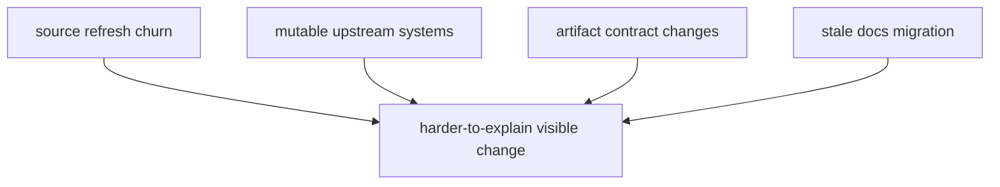

# Risk Register

The highest current risks are not equal. The most serious ones are the ones
that make visible evidence changes harder to explain.

## Risk Register Model

This page should keep the risk discussion anchored on explainability. The worst
risks are the ones that make a visible change larger, noisier, or less
defensible than the code or source difference actually was.

## Active Risks

- source refreshes can produce large tracked diffs that hide the meaningful
  logic change
- mutable upstream services can introduce surprising data churn
- report artifact contract changes can ripple into docs and review tooling
- incomplete doc migration can leave stale internal links

## First Proof Check

- workflow boundaries
- output naming rules
- docs and tests moving with public contract changes
- strict docs build and regression tests

## Design Pressure

The common failure is to track risks as generic project concerns instead of
focusing on the specific conditions that weaken reader trust in visible
evidence changes.
