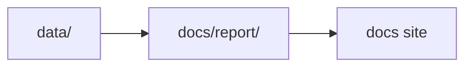

# Current App Scope

This page defines the current finished scope of the repository as it exists today.

## Included In The Current App

- tracked source collection for `aadr`, `boundaries`, `neotoma`, `raa`, and `sead`
- one shared Nordic map bundle under `docs/report/nordic-atlas/`
- country report bundles for Sweden, Norway, Finland, and Denmark
- machine-readable collection and report summaries
- one-command rebuilds for data, reports, and the docs site

## Current Deliverables

- `make data-prep` rebuilds the tracked data tree
- `make reports` rebuilds the published report bundles
- `make docs` rebuilds the MkDocs site
- `make app-state` rebuilds the current app scope end to end

## Not Included In The Current App

- lake distance intersections
- archaeological ranking outside the current RAÄ layer
- automatic site ranking
- offline basemap tiles
- genotype-level processing beyond tracked AADR `.anno` files

## Why This Boundary Matters

The repository is strongest when it treats the present app scope as a stable evidence workspace rather than implying that later interpretation and ranking features already exist.

## Purpose

This page records the current delivered app boundary so future work can extend it deliberately instead of blurring it.
