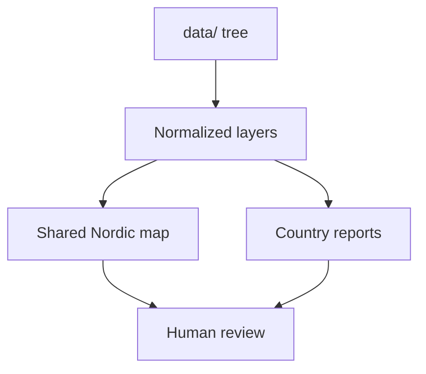

# Map-First Product Model

The documentation homepage is map-first because the shared Nordic map is the clearest integration surface in the repository.

This does **not** mean the map is the only durable artifact.

The map is a view over:

- tracked inputs
- normalized geospatial outputs
- copied report artifacts
- documented commands that can reproduce the same state

## Why Not Start With Code

Starting with code would force most readers to reverse-engineer the repository’s purpose from implementation details. Starting with the map lets readers immediately answer:

- what evidence is being combined
- what geography is being covered
- how filtering works
- what kind of output the repository exists to produce

## Why Not Redirect Away From Documentation Entirely

The homepage embeds the map, but keeps the documentation shell around it, because users also need:

- source explanations
- command references
- artifact layout rules
- architectural boundaries
- development workflow guidance

The docs should not hide the map, and the map should not replace the docs.

## Purpose

This page explains why the documentation experience is intentionally routed through the shared map.
