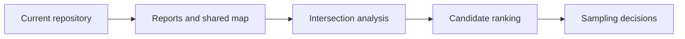

# Scope and Non-Goals

The current repository scope is deliberately narrower than the broader scientific ambition around site selection.

## In Scope Today

- collecting tracked source data into the five top-level `data/` categories
- classifying compatible records by country
- generating country-specific AADR reports
- generating one shared Nordic map with multi-country filtering
- documenting the repository so the full state can be rebuilt from a clean checkout

## Explicitly Not In Scope Yet

- lake-buffer intersection scoring
- archaeological site proximity ranking outside the current RAÄ coverage layer
- automated sampling-site recommendation logic
- full genotype processing from `.geno`, `.snp`, and `.ind`
- a production web backend or user account system

The sequence matters. The repository is intentionally building and checking the current evidence layers first so later ranking logic can be grounded in verified inputs rather than assumptions.

## Why The Boundaries Matter

Without clear non-goals, it becomes easy to:

- treat the repository as a general genomics warehouse
- overfit the code to one temporary experiment
- add heavy data that the current map and report pipeline never reads
- confuse future research goals with already-delivered capabilities

## Purpose

This page defines what the repository is responsible for now and what should remain future work until the current pipeline is stronger.
