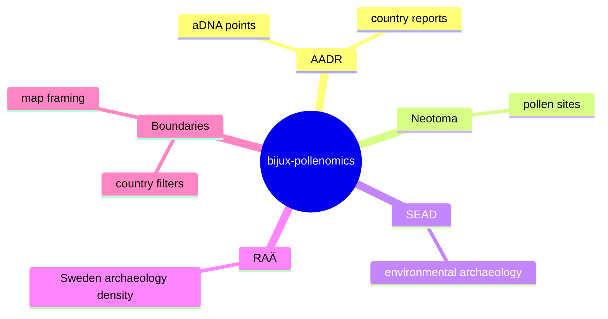

# What bijux-pollenomics Does

`bijux-pollenomics` builds a Nordic evidence workspace for inspecting where currently tracked aDNA, pollen-related, environmental archaeology, and archaeology layers occur together.

Today the checked-in workspace combines:

- ancient DNA sample locations from AADR
- Nordic pollen and paleoecology locations from Neotoma
- Nordic environmental archaeology locations from SEAD
- Swedish archaeology coverage from RAÄ / Fornsök
- country boundaries used to filter all compatible layers consistently

The repository is not just a static report dump. It is a file-oriented pipeline that:

1. collects tracked source inputs
2. normalizes them into a common geospatial shape
3. generates country reports
4. generates a shared Nordic map that can filter layers by country

The longer-term research goal is to use those layers as one input to later site-selection work. The repository does not currently rank sites or recommend field locations automatically.

## Why The Map Is Central

The map is the fastest way to validate whether the repository is producing interpretable spatial structure:

- are the points in the right countries
- do archaeology and pollen layers appear where expected
- can readers filter the evidence set down to one country
- can researchers inspect the current checked-in evidence without reading raw tables first

That is why the docs homepage embeds the shared map before anything else.

## Current Durable Outputs

- tracked source inputs under `data/`
- normalized data products under `data/*/normalized/`
- country report bundles under `docs/report/<country>/`
- a shared Nordic interactive map under `docs/report/nordic-atlas/`

## Purpose

This page explains the product outcome of the repository so later workflow and architecture pages are read with the right expectations.
