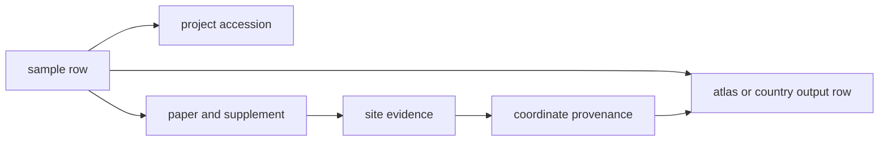

# Animal aDNA Data Model

The animal aDNA unit in this repository is not "species" and it is not
"project". It is a sample-backed evidence chain:

## Required File Families

Each tracked species root is expected to publish these reviewed surfaces:

| Layer | What it settles | Example |
| --- | --- | --- |
| project sample master | which recoverable sample rows exist per project and how they were recovered | [`data/adna/governance/source_library/projects/PRJEB36540/sample_master.json`](../../../data/adna/governance/source_library/projects/PRJEB36540/sample_master.json) |
| project sample sites | how each recovered sample row is tied to a direct site, grouped context, project-level locality, or unresolved geography | [`data/adna/governance/source_library/projects/PRJEB36540/sample_sites.json`](../../../data/adna/governance/source_library/projects/PRJEB36540/sample_sites.json) |
| sample records | which curated sample rows exist | [`data/adna/species/ovis_aries/normalized/sample_records.json`](../../../data/adna/species/ovis_aries/normalized/sample_records.json) |
| site evidence | what text or supplementary artifact supports the site | [`data/adna/species/ovis_aries/normalized/site_evidence.json`](../../../data/adna/species/ovis_aries/normalized/site_evidence.json) |
| coordinate provenance | why coordinates were accepted, geocoded, or refused | [`data/adna/species/ovis_aries/normalized/coordinate_provenance.json`](../../../data/adna/species/ovis_aries/normalized/coordinate_provenance.json) |
| country outputs | which rows survive country publication | [`docs/report/sweden/README.md`](../../report/sweden/README.md) |
| atlas outputs | which rows survive atlas publication | [`docs/report/nordic-atlas/nordic-atlas_animal_atlas_evidence.json`](../../report/nordic-atlas/nordic-atlas_animal_atlas_evidence.json) |

## Mandatory Sample Fields

The checked product contract also ships in machine-readable form under
[`data/adna/governance/animal_sample_product_contract.json`](../../../data/adna/governance/animal_sample_product_contract.json).

Every non-human sample row is expected to keep at least these questions
answerable:

- which stable sample identifier the repository uses
- which archive-native identifier, paper label, or supplementary-table label the stable identifier came from
- which species the sample belongs to
- which project accession anchors the sample
- which paper DOI or canonical paper URL supports the sample claim
- which supplementary or supporting source anchors the site claim
- which artifact path and row, appendix, or page anchors the sample identifier claim
- which site label is attached to the sample
- which raw chronology text the repository preserves
- which normalized BP interval the repository keeps when defensible
- which coordinate basis and coordinate confidence the repository keeps
- which inclusion or blocking status the repository assigns

## Core Fields

- sample identity: stable token, accession context, publication linkage
- sample-master lineage: archive-native id, paper label, supplementary-table label, lineage path, lineage locator, ambiguity note
- project linkage: accession, paper DOI, supplementary source when present
- sample-site assignment: direct sample site, grouped site claim, project-level locality only, named-place inference, region-only, or unresolved
- site evidence: locality label, political entity, quoted support text, support status
- locality hierarchy: site, municipality, region, country, broader geography
- coordinate provenance: basis, confidence, geocoding method, refusal or caveat
- publication posture: exact country, territory projection, regional projection, comparator-only, or blocked

## What This Model Refuses

- treating a project list as if it were already a sample table
- publishing region-only geography as if it were exact site coordinates
- hiding missing supplement extraction behind a species-level success claim
