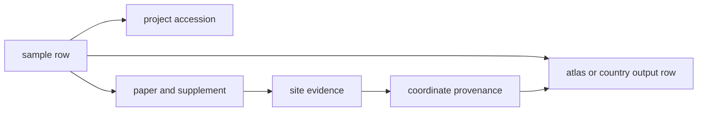

# Animal aDNA Data Model

The animal aDNA unit in this repository is not "species" and it is not
"project". It is a sample-backed evidence chain:

## Required File Families

Each tracked species root is expected to publish these reviewed surfaces:

| Layer | What it settles | Example |
| --- | --- | --- |
| sample records | which curated sample rows exist | [`data/adna/ovis_aries/normalized/sample_records.json`](../../../data/adna/ovis_aries/normalized/sample_records.json) |
| site evidence | what text or supplementary artifact supports the site | [`data/adna/ovis_aries/normalized/site_evidence.json`](../../../data/adna/ovis_aries/normalized/site_evidence.json) |
| coordinate provenance | why coordinates were accepted, geocoded, or refused | [`data/adna/ovis_aries/normalized/coordinate_provenance.json`](../../../data/adna/ovis_aries/normalized/coordinate_provenance.json) |
| country outputs | which rows survive country publication | [`docs/report/sweden/README.md`](../../report/sweden/README.md) |
| atlas outputs | which rows survive atlas publication | [`docs/report/nordic-atlas/nordic-atlas_animal_atlas_evidence.json`](../../report/nordic-atlas/nordic-atlas_animal_atlas_evidence.json) |

## Core Fields

- sample identity: stable token, accession context, publication linkage
- project linkage: accession, paper DOI, supplementary source when present
- site evidence: locality label, political entity, quoted support text, support status
- coordinate provenance: basis, confidence, geocoding method, refusal or caveat
- publication posture: exact country, territory projection, regional projection, comparator-only, or blocked

## What This Model Refuses

- treating a project list as if it were already a sample table
- publishing region-only geography as if it were exact site coordinates
- hiding missing supplement extraction behind a species-level success claim
