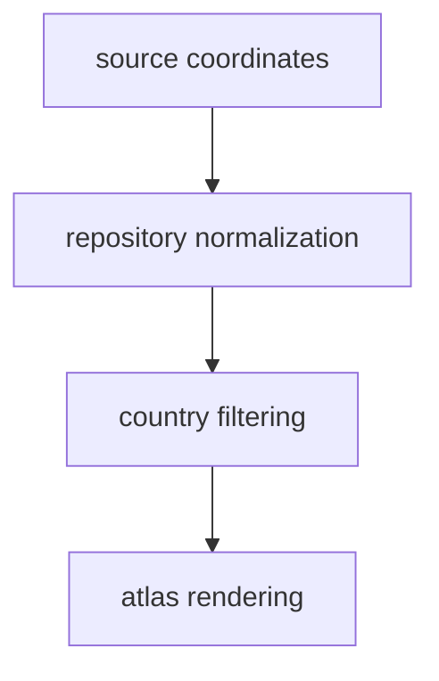

# Coordinate Policy

Spatial outputs are normalized so atlas rendering and country filtering can rely
on one consistent interpretation of location.

## Coordinate Model

This page should make coordinates feel like a trust surface. Spatial
normalization is not just format cleanup; it is what lets the atlas render
different evidence families under one consistent geographic interpretation.

## Current Policy

- preserve source identity while reshaping coordinates into repository-friendly
  outputs
- use normalized context layers for publication-facing rendering
- keep boundary-compatible country filtering central to the data workflow

## First Proof Check

- normalized GeoJSON outputs under `data/`
- the atlas bundle under `docs/report/nordic-atlas/`

## Design Pressure

The common failure is to treat coordinate reshaping as harmless plumbing, even
though small spatial interpretation changes can widen into visible filtering
and rendering errors across the atlas.
