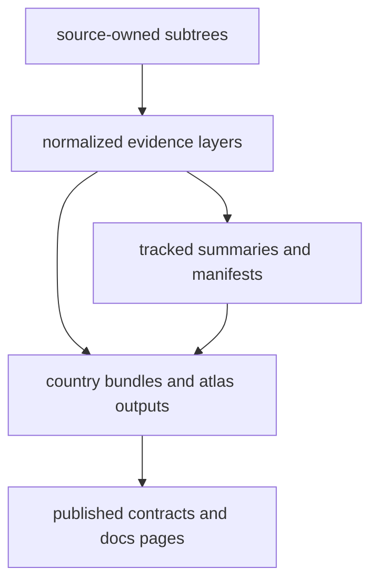

# Data System Overview

The pollenomics data system is a tracked file tree that separates source intake,
normalized evidence layers, and publication outputs.

## Data System Model

This page should give the shortest honest description of the evidence system:
tracked source material is narrowed into normalized files, summarized in-tree,
and then carried into visible publication surfaces in the same repository.

## Core Shape

- `data/` holds source-owned raw and normalized material
- `docs/report/` holds publication bundles derived from that tracked context
- `apis/` holds frozen API contracts that describe public-facing behavior around
  those outputs

## First Proof Check

- `data/`
- `docs/report/`
- `apis/`

## Design Pressure

The easy failure is to describe the data tree as storage first, when its real
job is to keep evidence, summaries, and publication outputs reviewable in one
commit history.
