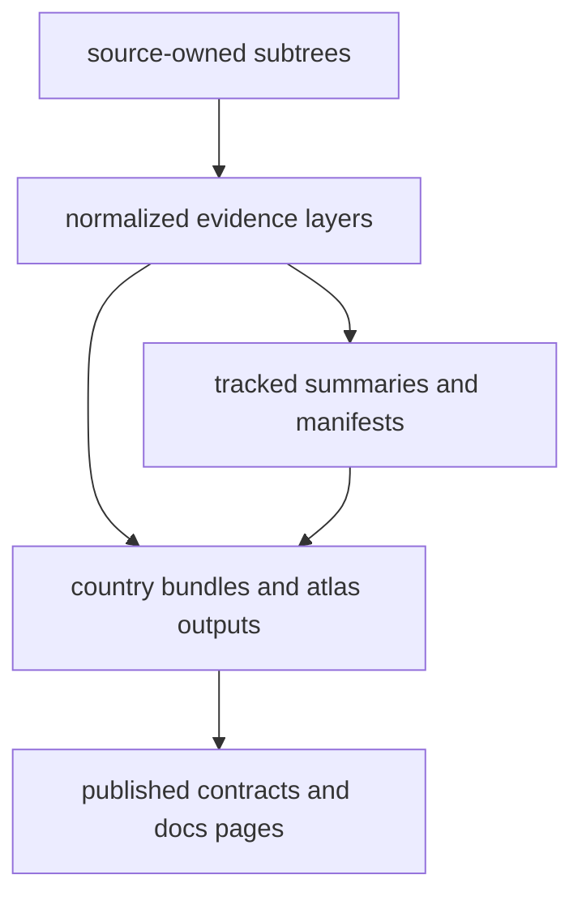

# Data System Overview

The pollenomics data system is a tracked file tree that separates source
intake, normalized evidence layers, and publication outputs without collapsing
all source families into one narrative.

## Data System Model

Tracked source material is narrowed into normalized files, summarized in-tree,
and then carried into visible publication surfaces in the same repository.

## Core Shape

- `data/` holds source-owned raw and normalized material
- `docs/report/` holds publication bundles derived from that tracked context
- `apis/` holds frozen API contracts that describe public-facing behavior around
  those outputs

## First Proof Check

- `data/`
- `docs/report/`
- `apis/`

## Design Pressure

The current failure mode is not only missing files. It is uneven explanation:
pollen, environmental, archaeology, and aDNA families must all remain legible
even when one recovery area currently demands more operational attention.
