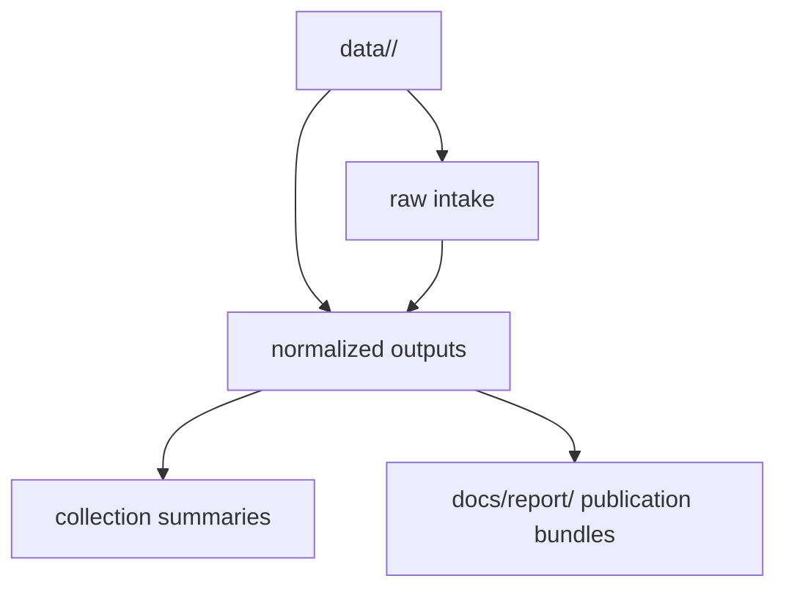

# Directory Layout

The tracked data layout is intentionally source-first.

## Layout Model

This page should make one structural rule visible: the repository keeps
upstream intake grouped by source and lets publication surfaces depend on that
shape, rather than hiding the chain inside one flat output tree.

## Top-Level Data Directories

- `data/aadr/`
- `data/boundaries/`
- `data/landclim/`
- `data/neotoma/`
- `data/raa/`
- `data/sead/`

## What The Layout Protects

- source-local changes stay reviewable instead of disappearing into one shared
  staging area
- normalized outputs stay adjacent to the source family that justifies them
- publication bundles can still be traced back to source-owned subtrees in the
  same commit

## First Proof Check

- `data/aadr/`
- `data/boundaries/`
- `data/landclim/`
- `data/neotoma/`
- `data/raa/`
- `data/sead/`

## Design Pressure

The common failure is to optimize for convenience and flatten the tree, which
usually makes provenance weaker, reviews noisier, and publication breakage
harder to isolate.
