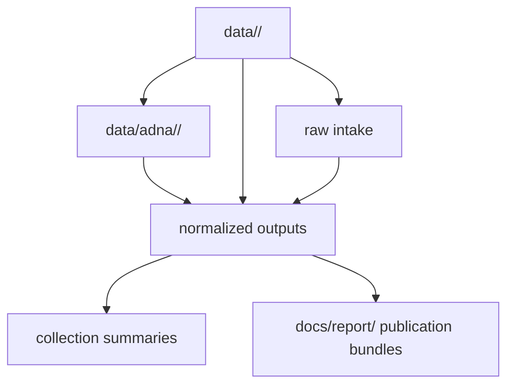

# Directory Layout

The tracked data layout is source-first for upstream intake, with a governed
species-owned ancient-DNA surface layered on top.

## Layout Model

This page should make one structural rule visible: the repository keeps
upstream intake grouped by source, but ancient DNA is also exposed through a
species-owned `data/adna/<latin_name>/...` contract so human-versus-animal
scope does not stay implicit inside source folders.

## Top-Level Data Directories

- `data/adna/`
- `data/aadr/`
- `data/boundaries/`
- `data/landclim/`
- `data/neotoma/`
- `data/raa/`
- `data/sead/`

## What The Layout Protects

- source-local changes stay reviewable instead of disappearing into one shared
  staging area
- `Homo sapiens` ancient DNA stays visibly species-owned instead of being
  treated as the whole aDNA layer
- domesticated-animal curation roots stay visible as species-owned review
  surfaces instead of being buried inside source-specific archive folders
- normalized outputs stay adjacent to the source family that justifies them
- publication bundles can still be traced back to source-owned subtrees in the
  same commit

## First Proof Check

- `data/adna/homo_sapiens/raw/aadr/`
- `data/adna/equus_caballus/`
- `data/adna/sus_scrofa_domesticus/`
- `data/adna/ovis_aries/`
- `data/adna/bos_taurus/`
- `data/adna/capra_hircus/`
- `data/adna/canis_lupus_familiaris/`
- `data/adna/felis_catus/`
- `data/adna/camelus_dromedarius/`
- `data/adna/rangifer_tarandus/`
- `data/adna/equus_asinus/`
- `data/aadr/`
- `data/boundaries/`
- `data/landclim/`
- `data/neotoma/`
- `data/raa/`
- `data/sead/`

The non-human roots are only honest if each one ships reviewable files, not
empty directories. A tracked species root is expected to carry archive
inventory under `raw/`, normalization summaries under `normalized/`, manifest
contracts under `manifests/`, support summaries under `reports/`, and review
evidence under `review/`.

## Design Pressure

The common failure is to optimize for convenience and flatten the tree, which
usually makes provenance weaker, hides species ownership inside source names,
and makes publication breakage harder to isolate.
