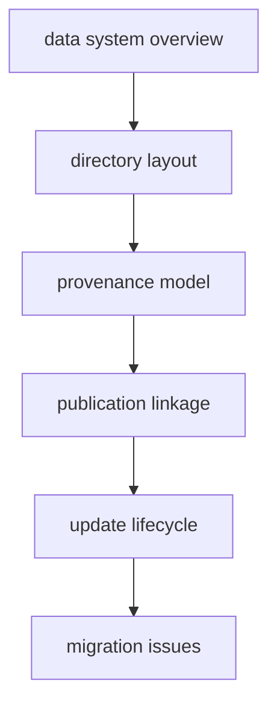

# Foundation

This section defines the shared rules of the tracked data tree before any one
source family or output bundle is discussed.

## Foundation Model

This section should move a reader from the broad shape of the tracked evidence
tree to the exact place where a rename, relocation, or publication promise
starts to create repository-wide cost.

## Start Here

- open [Data System Overview](https://bijux.io/bijux-pollenomics/02-bijux-pollenomics-data/foundation/data-system-overview/) for the shortest
  description of the tracked data model
- open [Directory Layout](https://bijux.io/bijux-pollenomics/02-bijux-pollenomics-data/foundation/directory-layout/) when the real question is file
  placement and ownership
- open [Provenance Model](https://bijux.io/bijux-pollenomics/02-bijux-pollenomics-data/foundation/provenance-model/) before changing how upstream
  origin is represented
- open [Migration Issues](https://bijux.io/bijux-pollenomics/02-bijux-pollenomics-data/foundation/migration-issues/) before renaming directories,
  moving files, or changing output expectations across the tree

## Section Pages

- [Data System Overview](https://bijux.io/bijux-pollenomics/02-bijux-pollenomics-data/foundation/data-system-overview/)
- [Directory Layout](https://bijux.io/bijux-pollenomics/02-bijux-pollenomics-data/foundation/directory-layout/)
- [Source Selection Rules](https://bijux.io/bijux-pollenomics/02-bijux-pollenomics-data/foundation/source-selection-rules/)
- [Update Lifecycle](https://bijux.io/bijux-pollenomics/02-bijux-pollenomics-data/foundation/update-lifecycle/)
- [Provenance Model](https://bijux.io/bijux-pollenomics/02-bijux-pollenomics-data/foundation/provenance-model/)
- [Naming Conventions](https://bijux.io/bijux-pollenomics/02-bijux-pollenomics-data/foundation/naming-conventions/)
- [Coordinate Policy](https://bijux.io/bijux-pollenomics/02-bijux-pollenomics-data/foundation/coordinate-policy/)
- [Publication Linkage](https://bijux.io/bijux-pollenomics/02-bijux-pollenomics-data/foundation/publication-linkage/)
- [Migration Issues](https://bijux.io/bijux-pollenomics/02-bijux-pollenomics-data/foundation/migration-issues/)

## What This Section Settles

- `data/` for the repository-owned tracked source tree
- `docs/report/` for the publication-facing outputs that depend on the shared
  data rules staying stable
- directory shape, provenance discipline, naming rules, coordinate handling,
  publication linkage, and migration cost

## First Proof Check

- `data/`
- `docs/report/`
- `data/collection_summary.json`

## Design Pressure

The common failure is to explain one data rule at a time while never showing
how directory shape, provenance discipline, and publication linkage constrain
each other as one tracked system.
