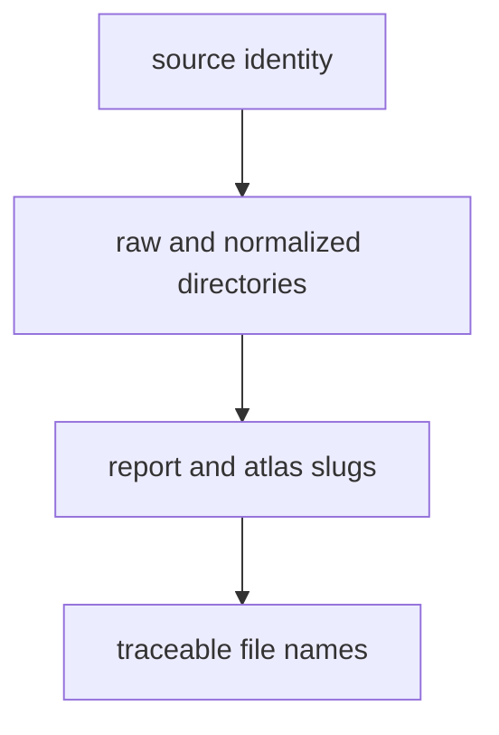

# Naming Conventions

Names in the data tree stay descriptive, stable, and source-oriented.

## Naming Model

This page should show naming as part of provenance discipline, not cosmetic
style. Stable source-oriented names are what let readers connect tracked trees
to visible outputs without guessing which layer came from where.

## Rules

- prefer source names over temporary migration labels
- keep raw and normalized directories explicit
- keep output slugs aligned with published report names
- avoid abbreviations unless they are already the accepted source identity, such
  as AADR or RAÄ

## First Proof Check

- `data/`
- `docs/report/`

## Design Pressure

The easy failure is to rename files for local convenience, which usually makes
source identity harder to recover and publication surfaces harder to audit.
