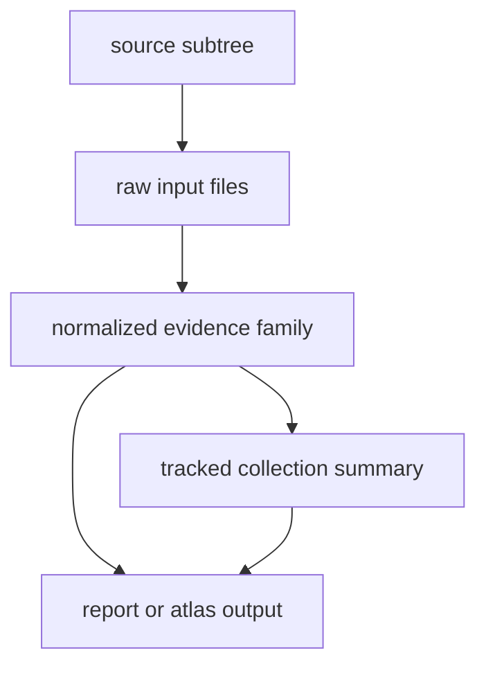

# Provenance Model

Provenance is preserved through source-owned directories, stable naming, and
collection summaries written into the tracked tree.

## Provenance Chain

This page should help a reader walk backward from one visible output to the
source subtree that justified it. If that walk breaks anywhere, the repository
is publishing confidence that it cannot defend from tracked files alone.

## Provenance Anchors

- source-specific raw directories
- normalized outputs that stay adjacent to their source
- `data/collection_summary.json` as a repository-wide refresh summary
- report manifests under `docs/report/` for publication outputs

## Design Pressure

The easy failure is to treat provenance as metadata sprinkled across outputs,
instead of a chain that must stay traversable from source subtree to published
surface in one reviewable history.

## Boundary Test

If a visible layer cannot be traced back through one source subtree, one
normalized family, or one checked-in summary, provenance is already too loose.
