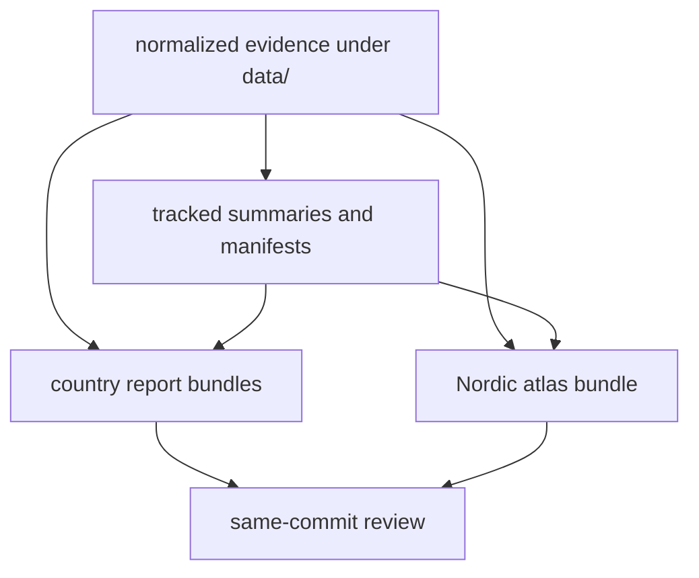

# Publication Linkage

Tracked data and tracked publication outputs are separate trees, but they are
tightly linked by contract.

## Linkage Model

This page should make publication honesty visible: report bundles and atlas
assets are allowed to live in `docs/report/`, but they only earn trust when
the same commit still explains them from tracked data and summaries.

## Linkage Rules

- normalized context data under `data/` feeds report publishing
- AADR versioned data under `data/aadr/` feeds country and atlas outputs
- report bundles under `docs/report/` should remain explainable from the tracked
  data tree present in the same commit

## First Proof Check

- `data/`
- `docs/report/`
- output pages in `docs/02-bijux-pollenomics-data/outputs/`

## Design Pressure

The common drift is to treat publication outputs as presentation-only material,
which breaks the requirement that readers and reviewers can explain a visible
change from tracked evidence in the same repository state.
