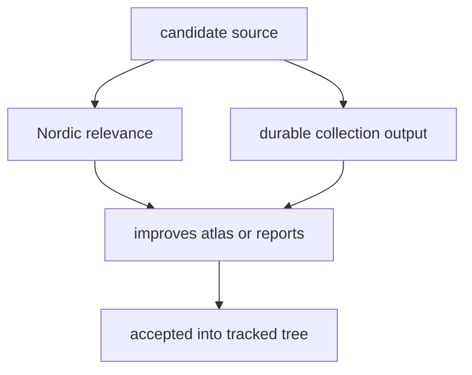

# Source Selection Rules

Sources are included when they make the checked-in evidence workspace more
reviewable and more relevant to Nordic context.

## Selection Model

This page should show that source inclusion is a repository decision, not a
vote for every interesting dataset. The tree accepts sources that strengthen
tracked evidence and reviewable publication surfaces, not everything that could
be queried or analyzed elsewhere.

## Current Selection Logic

- the source has a clear relationship to Nordic aDNA, pollen, environmental
  archaeology, or archaeological context
- the source can be collected into durable file outputs
- the source improves the atlas or country bundles without forcing a service
  architecture

## Design Pressure

The easy failure is to add a source because it seems useful in isolation,
without proving that it can be collected, normalized, reviewed, and published
inside this repository without dissolving the tracked evidence model.

## Boundary Test

If a source only makes sense as a live service dependency or as an analysis
engine, it does not fit this data tree.
