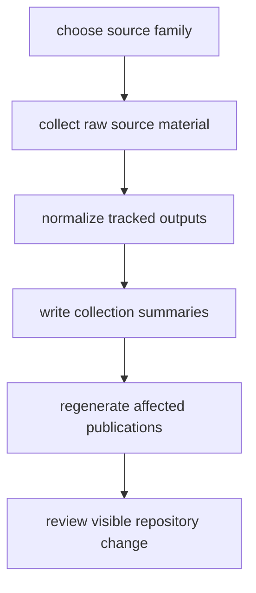

# Update Lifecycle

The data tree moves through a repeatable refresh lifecycle.

## Lifecycle Model

This page should frame refresh work as one repository change path, not five
unrelated steps. If that chain is not visible, readers will underestimate how
source refreshes alter both tracked evidence and public documentation surfaces.

## Lifecycle

1. choose one or more supported sources
2. collect raw source material
3. normalize it into tracked repository outputs
4. write collection summaries
5. regenerate affected publication bundles if required

## First Proof Check

- `data/<source>/raw/`
- `data/<source>/normalized/`
- `data/collection_summary.json`
- `docs/report/`

## Design Pressure

The common failure is to stop at successful collection and normalization, while
forgetting that the real repository obligation is to leave the updated evidence
and any affected publication surfaces reviewable together.
