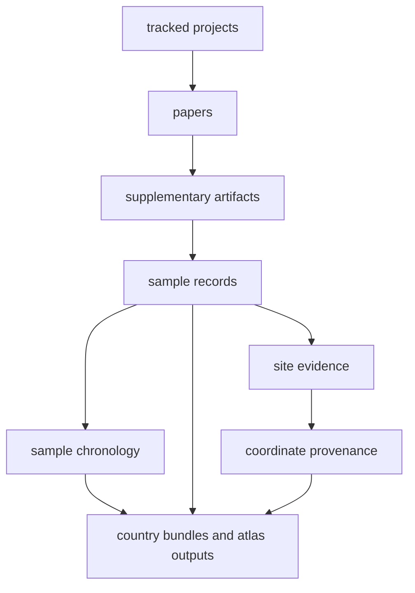

# bijux-pollenomics-data

`bijux-pollenomics-data` is the evidence handbook for the tracked sample
database. Its main job is to explain how project metadata, papers,
supplementary material, sample rows, site evidence, chronology, coordinate
provenance, and report outputs fit together around the real durable unit: the
sample record.

<strong>Use this section when the real question is evidence, not software.</strong> It should tell a reader where a sample row came from, why a site was accepted or blocked, how coordinates were justified, and which files feed the atlas and country bundles.

  <a class="md-button md-button--primary" href="samples/">Open the sample database files</a>
  <a class="md-button" href="projects/">Open tracked projects</a>
  <a class="md-button" href="sites/">Open site evidence</a>
  <a class="md-button" href="coordinates/">Open coordinate provenance</a>
  <a class="md-button" href="outputs/published-reports/">Open country output files</a>
  <a class="md-button" href="outputs/nordic-atlas/">Open atlas output files</a>

## Evidence Route

## Start Here

- sample, site, and coordinate contract: [foundation](foundation/index.md)
- tracked project intake: [projects](projects/index.md)
- paper capture: [papers](papers/index.md)
- supplementary capture: [supplements](supplements/index.md)
- sample database files: [samples](samples/index.md)
- site extraction and locality posture: [sites](sites/index.md)
- chronology normalization: [chronology](chronology/index.md)
- coordinate provenance: [coordinates](coordinates/index.md)
- atlas and country output files: [outputs](outputs/index.md)
