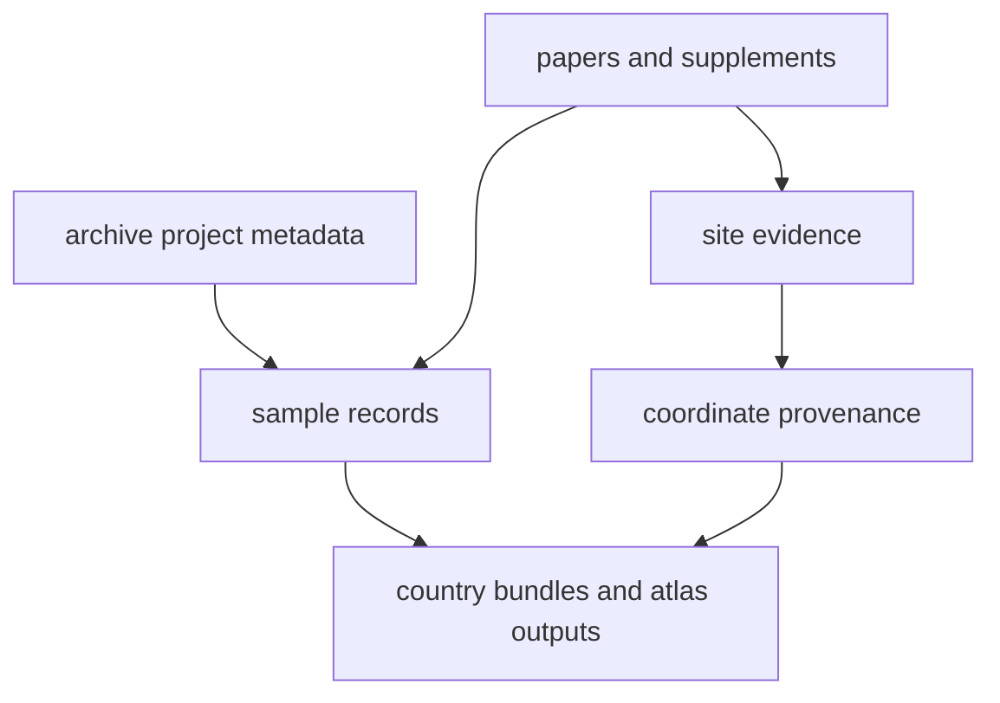

# bijux-pollenomics-data

`bijux-pollenomics-data` is the evidence handbook for the tracked data tree.
Its main job is to explain how project metadata, papers, supplementary
material, sample rows, site evidence, coordinate provenance, and report outputs
fit together.

<strong>Use this section when the real question is evidence, not software.</strong> It should tell a reader where a sample row came from, why a site was accepted or blocked, how coordinates were justified, and which files feed the atlas and country bundles.

  <a class="md-button md-button--primary" href="foundation/animal-adna-data-model/">Open the animal aDNA data model</a>
  <a class="md-button" href="sources/">Open project, paper, and supplement capture</a>
  <a class="md-button" href="outputs/published-reports/">Open country output files</a>
  <a class="md-button" href="outputs/nordic-atlas/">Open atlas output files</a>

## Evidence Route

## Start Here

- sample, site, and coordinate contract: [foundation](foundation/index.md)
- animal aDNA row contract: [animal aDNA data model](foundation/animal-adna-data-model.md)
- project, paper, and supplement capture: [sources](sources/index.md)
- atlas and country output files: [outputs](outputs/index.md)
