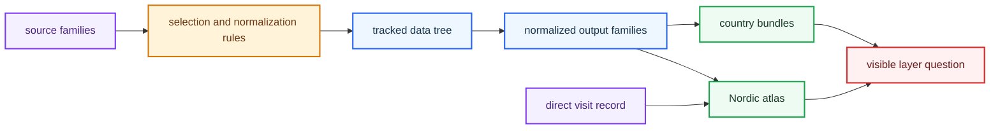

# bijux-pollenomics-data

`bijux-pollenomics-data` is the provenance and output handbook for the tracked
evidence tree. Open it when the real question is where a visible layer came
from, what was normalized, which file family became authoritative, or how a
layout change would ripple through the repository.

<strong>Follow the evidence from source to tracked file to published surface.</strong> This branch explains source selection, normalization rules, output families, and the narrow fieldwork record that anchors one visible map point to a real visit.

  <a class="md-button md-button--primary" href="https://bijux.io/bijux-pollenomics/02-bijux-pollenomics-data/outputs/nordic-atlas/">Open atlas outputs</a>
  <a class="md-button" href="https://bijux.io/bijux-pollenomics/02-bijux-pollenomics-data/sources/source-comparison/">Compare source families</a>
  <a class="md-button" href="https://bijux.io/bijux-pollenomics/04-fieldwork/lyngsjon-lake-fieldwork/">Open fieldwork record</a>

## Evidence Route

This handbook is the evidence map behind the public site. It keeps three
questions separate: what the repository accepted from upstream sources, how
that material was narrowed into tracked files, and which checked-in outputs
carry those files into reader-facing reports or the atlas. That separation is
the difference between a persuasive documentation surface and a list of file
paths.

## Section Pages

- [Foundation](https://bijux.io/bijux-pollenomics/02-bijux-pollenomics-data/foundation/)
- [Sources](https://bijux.io/bijux-pollenomics/02-bijux-pollenomics-data/sources/)
- [Outputs](https://bijux.io/bijux-pollenomics/02-bijux-pollenomics-data/outputs/)
- [Fieldwork](https://bijux.io/bijux-pollenomics/04-fieldwork/)

## Start Here

- upstream origin, caveats, and refresh limits: [Sources](https://bijux.io/bijux-pollenomics/02-bijux-pollenomics-data/sources/)
- exact file families and publication bundles: [Outputs](https://bijux.io/bijux-pollenomics/02-bijux-pollenomics-data/outputs/)
- tracked tree rules and migration cost: [Foundation](https://bijux.io/bijux-pollenomics/02-bijux-pollenomics-data/foundation/)
- one direct visit record behind a mapped point: [Fieldwork](https://bijux.io/bijux-pollenomics/04-fieldwork/)

## What This Handbook Settles

- where a visible layer came from
- what normalization happened before publication
- which tracked files support the atlas or country bundles
- which layout changes would create wide migration cost

## First Proof Check

- `data/`
- `docs/report/`
- `docs/04-fieldwork/`

## Boundary Test

If a question is really about runtime commands, repository automation, or the
meaning of one published atlas point, this handbook should route the reader out
instead of answering too broadly.
