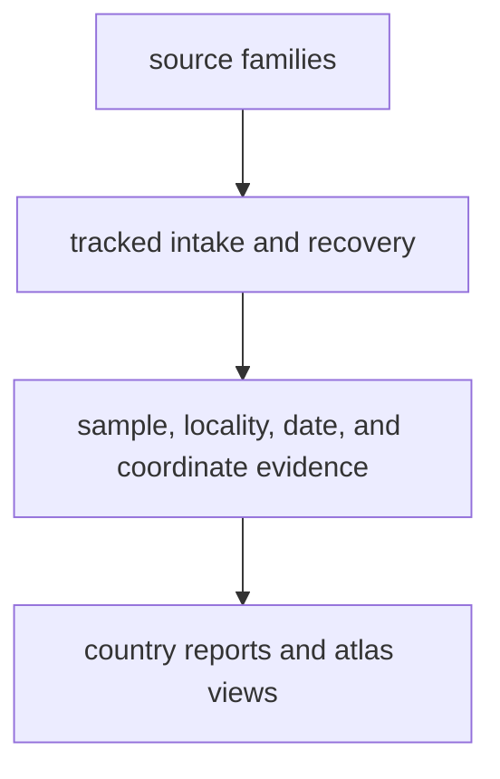

# bijux-pollenomics-data

`bijux-pollenomics-data` is the public guide to the repository's evidence
layers. It explains how pollen context, environmental archaeology, boundary framing,
animal ancient DNA, and public outputs fit together, how those records are
checked and organized, and how they later appear in country reports or the
Nordic atlas.

<strong>Use this section when the real question is about evidence, coverage, or trust.</strong> It should help a reader answer simple questions clearly: what the repository knows, where it came from, what is still incomplete, and why some records appear in public outputs while others do not.

  <a class="md-button md-button--primary" href="overview/">Start with the overview</a>
  <a class="md-button" href="overview/data-architecture-handbook/">Open the data architecture handbook</a>
  <a class="md-button" href="sources/">See the source families</a>
  <a class="md-button" href="overview/pollenomics-publication-model/">See the pollenomics publication model</a>
  <a class="md-button" href="overview/provenance-and-publication-linkage/">See provenance and publication linkage</a>
  <a class="md-button" href="overview/cross-domain-evidence-matrix/">Open the cross-domain evidence matrix</a>
  <a class="md-button" href="overview/source-selection-and-refresh/">See source selection and refresh</a>
  <a class="md-button" href="overview/coverage-and-naming/">See coverage and naming</a>
  <a class="md-button" href="sources/animal-source-intake/">See animal source intake</a>
  <a class="md-button" href="evidence/">See sample-to-map evidence</a>
  <a class="md-button" href="outputs/">See public outputs</a>
  <a class="md-button" href="sources/source-comparison/">Open the source comparison</a>

## What This Section Covers

The point of this guide is to keep those steps legible. The site should not
force readers to infer the difference between a source, a recovered sample
table, a locality decision, and a public map point.

## Start Here

- [Overview](overview/index.md): how the data system is organized and how to read it
- [Data architecture handbook](overview/data-architecture-handbook.md): where truth lives and how raw, normalized, review, and publication stages differ
- [Sources](sources/index.md): the main source families, from pollen context to animal ancient DNA
- [Evidence](evidence/index.md): how sample records, localities, chronology, and coordinates are justified
- [Outputs](outputs/index.md): what the country reports and the Nordic atlas publish
- [Cross-domain evidence matrix](overview/cross-domain-evidence-matrix.md): how domain balance is audited without file-count theater

## Restored System Coverage

- [provenance and publication linkage](overview/provenance-and-publication-linkage.md)
- [source selection and refresh](overview/source-selection-and-refresh.md)
- [coverage and naming](overview/coverage-and-naming.md)

## Source-Family Comparison

Start with the [source-family comparison](sources/source-comparison.md) when the
main question is how pollen, archaeology, boundaries, and ancient DNA differ.

## Reader Questions

- Where does the repository's pollen, archaeology, boundary, and aDNA material come from?
- What happens between a paper or dataset and a public-facing output?
- Which animal records already have sample-level locality and date evidence?
- Why is one row publishable while another stays blocked or uncertain?

## Section Map

| Section | Main question | Main pages |
| --- | --- | --- |
| Overview | How is the repository's data system structured? | [overview](overview/index.md) |
| Sources | What source families are in scope and what do they contribute? | [sources](sources/index.md) |
| Evidence | How are sample, locality, chronology, and coordinate claims justified? | [evidence](evidence/index.md) |
| Outputs | What reaches reports and maps, and what remains partial? | [outputs](outputs/index.md) |
