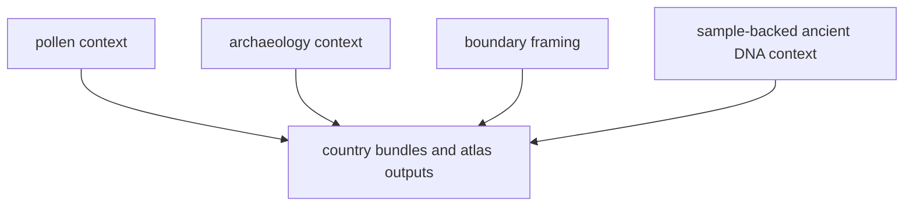

# bijux-pollenomics-data

`bijux-pollenomics-data` is the evidence handbook for the tracked data system.
Its main job is to explain how pollen context, environmental archaeology,
boundary geometry, fieldwork records, ancient DNA source capture, normalized
evidence files, and report outputs fit together without pretending that one
thin slice already explains the whole repository.

<strong>Use this section when the real question is evidence, not software.</strong> It should tell a reader where a sample row came from, why a site was accepted or blocked, how coordinates were justified, and which files feed the atlas and country bundles.

  <a class="md-button md-button--primary" href="foundation/data-system-overview/">Open the data system overview</a>
  <a class="md-button" href="sources/source-comparison/">Open the source comparison</a>
  <a class="md-button" href="sources/aadr/">Open AADR context</a>
  <a class="md-button" href="sources/neotoma/">Open Neotoma context</a>
  <a class="md-button" href="outputs/published-reports/">Open country output files</a>
  <a class="md-button" href="outputs/nordic-atlas/">Open atlas output files</a>

## Evidence Route

## Start Here

- data-system overview: [foundation](foundation/index.md)
- source-family comparison: [sources/source-comparison](sources/source-comparison.md)
- tracked project intake: [projects](projects/index.md)
- paper capture: [papers](papers/index.md)
- supplementary capture: [supplements](supplements/index.md)
- sample database files: [samples](samples/index.md)
- site extraction and locality posture: [sites](sites/index.md)
- chronology normalization: [chronology](chronology/index.md)
- coordinate provenance: [coordinates](coordinates/index.md)
- atlas and country output files: [outputs](outputs/index.md)
