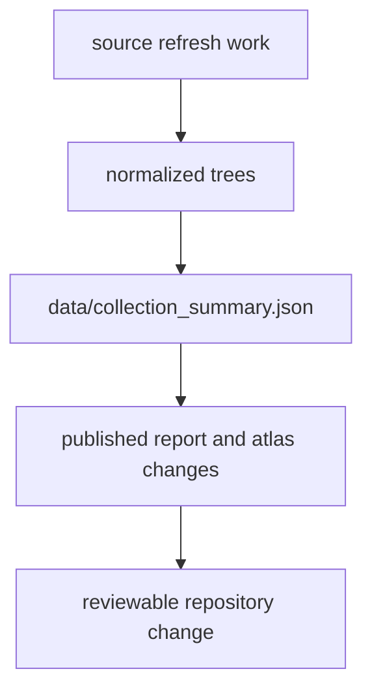

# Collection Summary

`data/collection_summary.json` is the shortest checked-in summary of a tracked
refresh.

## Summary Model

This page makes the summary file feel like a review bridge, not a stray
diagnostic. It exists so one refresh can be read quickly before a reviewer
dives into normalized trees or visible publication bundles.

## What It Shows

- one cross-source view of the current collection state
- source counts and refresh outcomes that reviewers can inspect quickly
- the bridge between source refresh work and later publication changes

## Boundary

The collection summary is a diagnostic ledger, not a reader-facing report. It
shows what changed in the tracked tree, but it does not replace the normalized
output pages or the published atlas and report surfaces.

## First Proof Check

- inspect `data/collection_summary.json`
- compare it against the matching `data/*/normalized/` trees and `docs/report/` outputs
- compare with the [cross-domain evidence matrix](../../report/repository_cross_domain_evidence_matrix.md) when the real question is balanced domain coverage rather than one refresh snapshot
