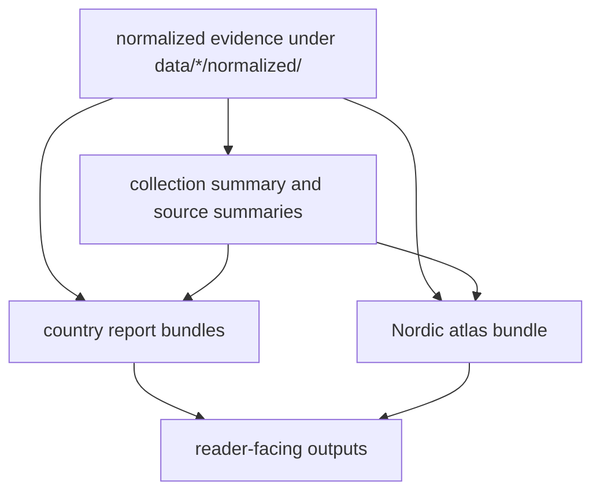

# Outputs

This section defines the checked-in output families that the data system
produces.

These pages separate three different surfaces that are easy to blur together:
normalized repository-owned evidence files under `data/*/normalized/`,
publication bundles under `docs/report/<country-slug>/`, and the shared Nordic
atlas publication under `docs/report/nordic-atlas/`.

## Outputs Model

This section should help a reader distinguish repository-owned evidence layers
from publication bundles immediately. If those surfaces blur together, every
later question about review cost or output trust becomes harder to answer.

## Start Here

- open [Collection Summary](https://bijux.io/bijux-pollenomics/02-bijux-pollenomics-data/outputs/collection-summary/)
  for the shortest checked-in view of the current cross-source state
- open one normalized output page when the question is about one repository
  file family rather than the upstream source that feeds it
- open [Published Reports](https://bijux.io/bijux-pollenomics/02-bijux-pollenomics-data/outputs/published-reports/)
  when the question is about country bundles that readers consume directly
- open [Nordic Atlas Outputs](https://bijux.io/bijux-pollenomics/02-bijux-pollenomics-data/outputs/nordic-atlas/)
  when the question is about the shared map publication and its shipped assets

## Section Pages

- [Collection Summary](https://bijux.io/bijux-pollenomics/02-bijux-pollenomics-data/outputs/collection-summary/)
- [Normalized AADR Outputs](https://bijux.io/bijux-pollenomics/02-bijux-pollenomics-data/outputs/normalized-aadr/)
- [Normalized Boundary Outputs](https://bijux.io/bijux-pollenomics/02-bijux-pollenomics-data/outputs/normalized-boundaries/)
- [Normalized LandClim Outputs](https://bijux.io/bijux-pollenomics/02-bijux-pollenomics-data/outputs/normalized-landclim/)
- [Normalized Neotoma Outputs](https://bijux.io/bijux-pollenomics/02-bijux-pollenomics-data/outputs/normalized-neotoma/)
- [Normalized RAÄ Outputs](https://bijux.io/bijux-pollenomics/02-bijux-pollenomics-data/outputs/normalized-raa/)
- [Normalized SEAD Outputs](https://bijux.io/bijux-pollenomics/02-bijux-pollenomics-data/outputs/normalized-sead/)
- [Published Reports](https://bijux.io/bijux-pollenomics/02-bijux-pollenomics-data/outputs/published-reports/)
- [Nordic Atlas Outputs](https://bijux.io/bijux-pollenomics/02-bijux-pollenomics-data/outputs/nordic-atlas/)

## What This Section Settles

- which files are intermediate normalized evidence surfaces
- which files are public publication bundles
- where the atlas sits in relation to both

## First Proof Check

- inspect `data/*/normalized/` for the repository-owned evidence layers
- inspect `docs/report/<country-slug>/` for the country-facing publication
  bundles
- inspect `docs/report/nordic-atlas/` for the shared map bundle and supporting
  files

## Design Pressure

The easy failure is to describe every checked-in file as if it had the same
review role, even though normalized evidence, country publications, and atlas
assets carry different promises to the reader.

## Boundary Test

This section starts from checked-in outputs, not from upstream source caveats
and not from runtime rebuild commands. Open
[Sources](https://bijux.io/bijux-pollenomics/02-bijux-pollenomics-data/sources/)
for upstream limits and open the
[runtime handbook](https://bijux.io/bijux-pollenomics/01-bijux-pollenomics/)
when the question becomes how these files were regenerated.
