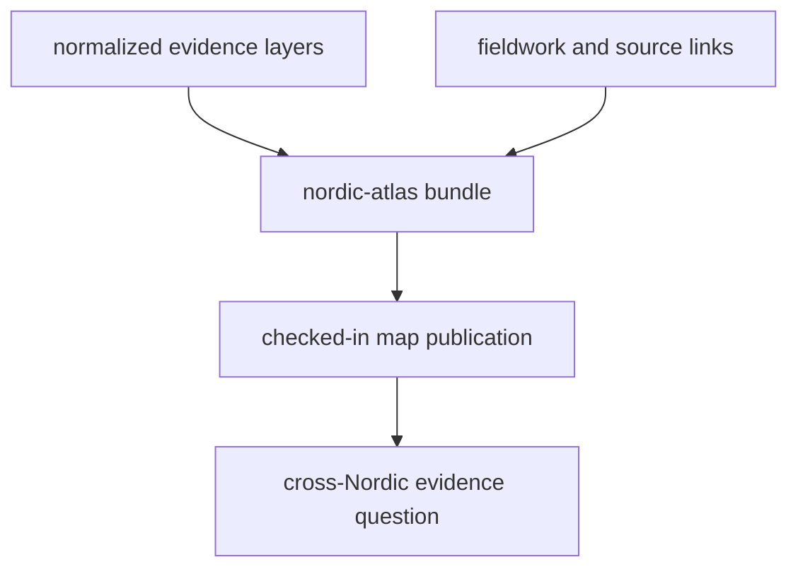

# Nordic Atlas Outputs

The shared atlas bundle lives under `docs/report/nordic-atlas/`.

## Atlas Bundle Model

This page should make the atlas bundle feel like a checked-in publication
package with traceable inputs. If the atlas is described only as one HTML map,
the reader loses sight of the layers and links that justify what the map shows.

## What This Output Family Includes

- `nordic-atlas_map.html` as the checked-in map publication
- source-derived GeoJSON and JSON files that the atlas renders together
- `_map_assets/` as the shipped asset bundle for the interactive surface
- candidate ranking sidecars:
  `nordic-atlas_candidate_sites.csv` and `nordic-atlas_candidate_sites.md`

## Boundary

The atlas bundle is the main public evidence surface of the repository, but it
is still a publication package. It renders normalized data and fieldwork links.
It does not replace the source pages, the normalized output pages, or the
runtime docs that explain rebuild behavior.

The candidate ranking sidecars inherit that same boundary. They summarize
nearby context against tracked layers. They do not convert atlas publication
outputs into a validated site-selection model.

## First Proof Check

- inspect `docs/report/nordic-atlas/`
- open [Nordic Evidence Atlas](https://bijux.io/bijux-pollenomics/05-nordic-evidence-atlas/)
  when the question is about the reader-facing publication page rather than the
  checked-in bundle

## Design Pressure

The easy failure is to talk about the atlas as a self-explanatory surface,
which invites readers to trust the rendering more than the tracked evidence and
link structure that support it.
