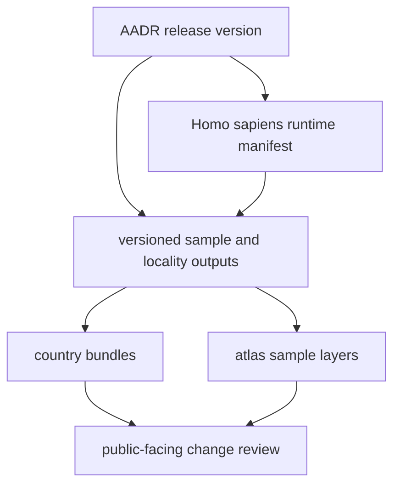

# Normalized AADR Outputs

The upstream AADR release remains versioned under `data/aadr/<version>/`, while
the governed `Homo sapiens` species surface lives under
`data/adna/homo_sapiens/`.

## AADR Output Model

This page should make one point clear: AADR is the strongest direct bridge
between one upstream version and visible publication change. Readers should be
able to see that version identity all the way into reports and atlas layers.

## What This Output Family Carries

- sample metadata and locality records used by country bundles and the atlas
- a visible bridge from `data/aadr/<version>/` to `data/adna/homo_sapiens/raw/aadr/<version>/`
- visible version identity in the tracked tree
- the strongest direct line from AADR refreshes to public publication changes

## Boundary

These files are repository-owned normalized outputs, not the entire upstream
release and not genotype analysis artifacts. Their role is to make the checked-in
sample layer reviewable and publishable.

## First Proof Check

- inspect `data/adna/homo_sapiens/raw/aadr/v66/`
- inspect `data/aadr/v66/`
- compare with [AADR](https://bijux.io/bijux-pollenomics/02-bijux-pollenomics-data/sources/aadr/)
  when the question is about upstream scope rather than checked-in outputs

## Design Pressure

The common failure is to strip away version identity or species ownership once
files are normalized, which makes major publication changes look generic when
they are actually tied to one specific AADR release inside the `Homo sapiens`
surface.
