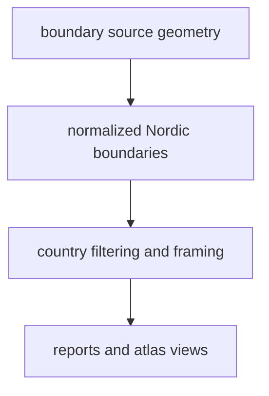

# Normalized Boundary Outputs

Boundary outputs live under `data/boundaries/normalized/`.

## Boundary Output Model

This page shows why boundary files matter even though they are not the main
scientific evidence. They define the spatial frame that keeps report and atlas
publication readable and reviewable.

## What This Output Family Carries

- stable country geometry used by reports and the atlas
- a shared spatial frame that stays separate from scientific source outputs
- one reusable filter surface for Nordic publication views

## Boundary

These files make map framing and country filtering reviewable. They do not add
scientific evidence by themselves, and they should not be read as equivalent to
ancient DNA, pollen, or archaeology layers.

## First Proof Check

- inspect `data/boundaries/normalized/nordic_country_boundaries.geojson`
- inspect `docs/report/regions/nordic/nordic_country_boundaries.geojson`
- compare with [Boundaries](../sources/boundaries.md) when the question is about upstream framing logic
