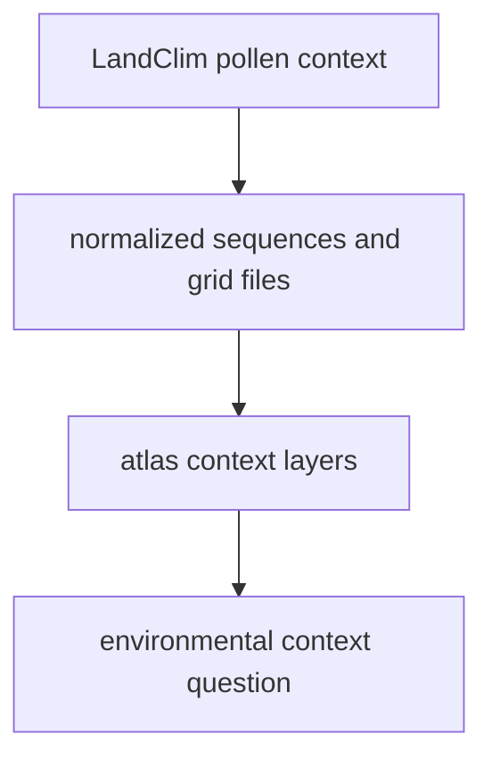

# Normalized LandClim Outputs

LandClim normalized outputs live under `data/landclim/normalized/`.

## LandClim Output Model

This page should make the LandClim role legible: it broadens the atlas beyond
sample points by adding environmental context, while still remaining distinct
from ancient DNA and direct fieldwork surfaces.

## What This Output Family Carries

- pollen sequence context in CSV and GeoJSON form
- REVEALS grid-cell geometry used for atlas context layers
- one of the main environmental surfaces that broadens publication beyond
  ancient DNA sample points

## Boundary

These files are contextual environmental outputs. They do not replace ancient
DNA metadata, and they do not imply direct field collection just because they
are rendered on the same atlas surface.

## First Proof Check

- inspect `data/landclim/normalized/`
- compare with [LandClim](https://bijux.io/bijux-pollenomics/02-bijux-pollenomics-data/sources/landclim/)
  when the question is about upstream acquisition or caveats

## Design Pressure

The common failure is to let contextual environmental layers inherit the
certainty of sample-locality data just because both appear in the same atlas
view.
