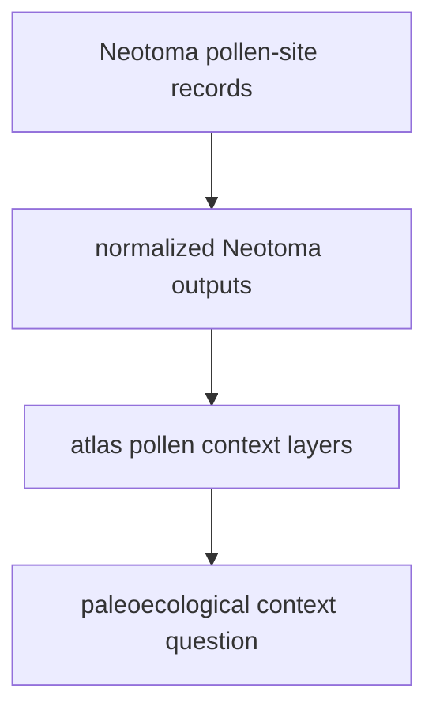

# Normalized Neotoma Outputs

Neotoma normalized outputs live under `data/neotoma/normalized/`.

## Neotoma Output Model

This page keeps Neotoma visible as its own evidence family. It adds pollen-site
context to the atlas without dissolving into a generic environment layer.

## What This Output Family Carries

- paleoecological pollen-site records prepared for atlas use
- source-visible provenance in CSV and GeoJSON form
- an environmental context family that stays distinct from LandClim even when both appear as pollen context

## Boundary

These files let the atlas publish Neotoma-derived context without collapsing it
into a generic pollen layer. They do not answer ancient DNA or archaeology
questions on their own.

## First Proof Check

- inspect `data/neotoma/normalized/`
- inspect `docs/report/regions/nordic/nordic_pollen_sites.geojson`
- compare with [Neotoma](../sources/neotoma.md) when the question is about source-specific provenance
