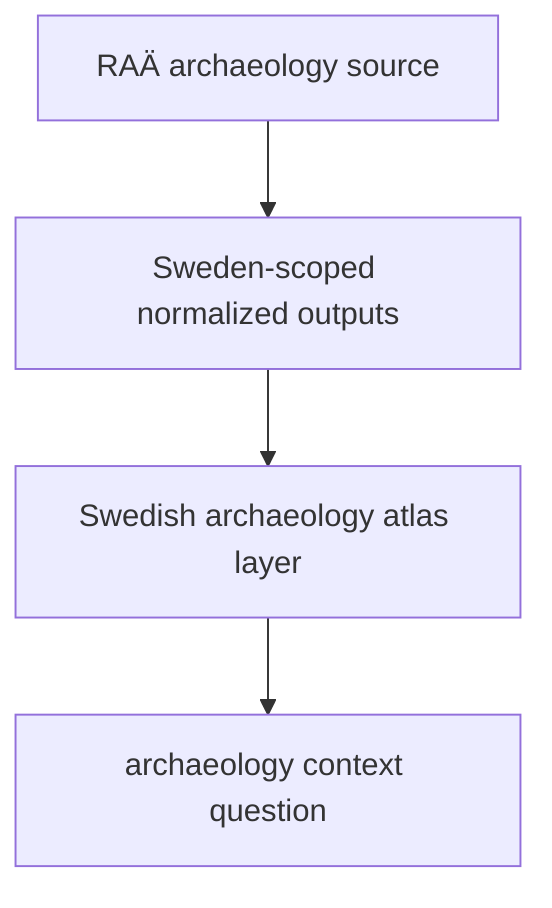

# Normalized RAÄ Outputs

RAÄ normalized outputs live under `data/raa/normalized/`.

## RAÄ Output Model

This page makes the geographic limit part of the headline logic. RAÄ is useful
because it stays explicitly Sweden-scoped even when rendered next to
Nordic-wide layers.

## What This Output Family Carries

- Swedish archaeology density geometry
- Sweden-scoped contextual files that enrich the atlas without pretending to cover the full Nordic region
- one output family whose geographic limit is part of its meaning

## Boundary

These files are useful because they keep the Swedish scope explicit. They
should not be generalized into Nordic-wide archaeology coverage just because
they are rendered beside Nordic-wide layers.

## First Proof Check

- inspect `data/raa/normalized/`
- inspect `docs/report/nordic-atlas/sweden_archaeology_density.geojson`
- compare with [RAÄ](../sources/raa.md) when the question is about source scope rather than normalized outputs
