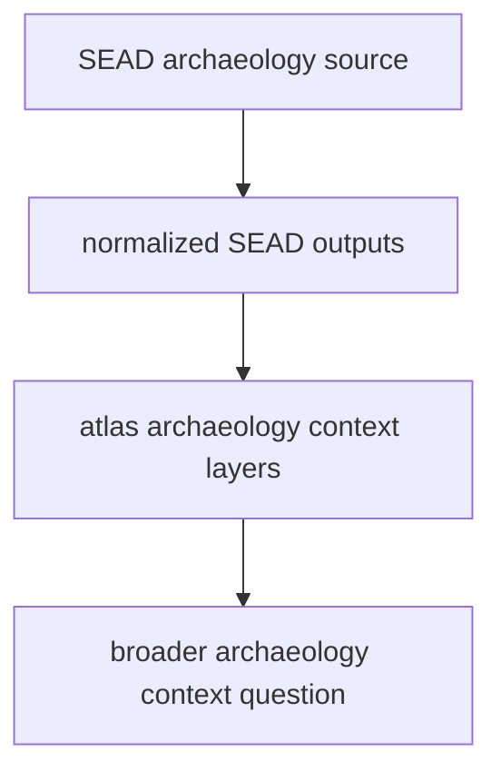

# Normalized SEAD Outputs

SEAD normalized outputs live under `data/sead/normalized/`.

## SEAD Output Model

This page explains the output boundary. SEAD belongs beside RAÄ without
becoming identical to it. SEAD gives broader archaeology context, but it still
carries its own source story, access limits, and temporal interpretation
limits.

## What This Output Family Carries

- environmental archaeology site records in CSV and GeoJSON form
- a broader archaeology context family than the Sweden-only RAÄ surface
- atlas-ready files that keep source ownership visible
- access and legibility review surfaces under `data/sead/review/`

## Boundary

These files add contextual archaeology layers to the atlas. They do not become
equivalent to RAÄ just because both are archaeology context, and they do not
replace source-specific interpretation.

If a row still behaves like a thin site inventory capture, the normalized file
should carry that limitation forward rather than hiding it behind a clean point
geometry.

## First Proof Check

- inspect `data/sead/normalized/`
- inspect `data/sead/review/evidence_legibility_review.json`
- inspect `data/sead/review/access_model.json`
- inspect `docs/report/regions/nordic/nordic_environmental_sites.geojson`
- compare with [SEAD](../sources/sead.md) when the question is about the upstream family rather than the output shape
- read the [SEAD Handbook](../sources/sead-handbook.md) when the question is about access posture, temporal caveats, or recovery limits
