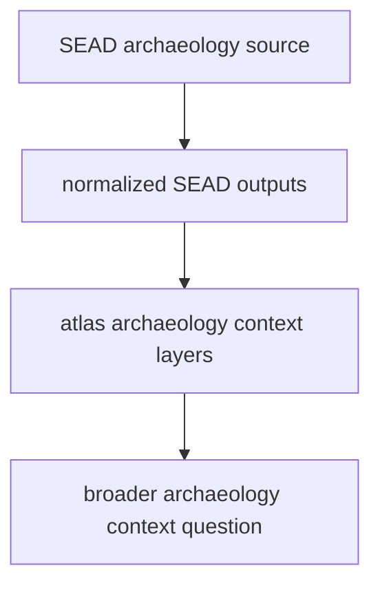

# Normalized SEAD Outputs

SEAD normalized outputs live under `data/sead/normalized/`.

## SEAD Output Model

This page shows why SEAD belongs beside RAÄ without becoming identical to it.
SEAD gives broader archaeology context, but it still carries its own source
story and interpretation limits.

## What This Output Family Carries

- environmental archaeology site records in CSV and GeoJSON form
- a broader archaeology context family than the Sweden-only RAÄ surface
- atlas-ready files that keep source ownership visible

## Boundary

These files add contextual archaeology layers to the atlas. They do not become
equivalent to RAÄ just because both are archaeology context, and they do not
replace source-specific interpretation.

## First Proof Check

- inspect `data/sead/normalized/`
- inspect `docs/report/regions/nordic/nordic_environmental_sites.geojson`
- compare with [SEAD](../sources/sead.md) when the question is about the upstream family rather than the output shape
