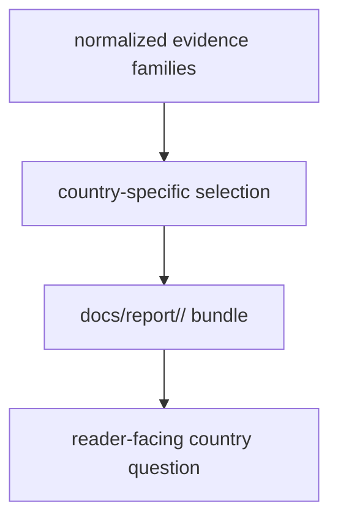

# Published Reports

Published report bundles live under `docs/report/<country-slug>/`.
Cross-country public animal reporting artifacts now live directly under
`docs/report/` beside the shared atlas and the country directories.

## Report Bundle Model

This page should make country reports read as curated publication bundles, not
as the whole repository compressed into one folder. They answer one country
question at reader speed while still depending on narrower tracked evidence
layers underneath.

## Current Bundle Families

- Denmark
- Finland
- Norway
- Sweden

## What This Output Family Carries

- country-facing evidence slices prepared for readers rather than raw review
- country-facing animal aDNA addenda when tracked Nordic animal locality leads
  can be assigned honestly into one country surface
- the clearest public bundle for one country-specific evidence question
- a publication layer that sits above normalized data without hiding where it
  came from
- one shared root-level surface for animal-output audit, cross-country species
  coverage, chronology overlap, first-appearance review, and Nordic
  farming-history scenario reporting

## Boundary

These bundles are reader-facing reports, not the full repository state. They
should not be mistaken for the normalized source trees that feed them or for
the atlas surface that compares families across the Nordic region.

The root `docs/report/` directory is part of the same publication family. It
now carries the cross-country animal-review outputs that would be misleading if
they were duplicated four times inside the country directories.

## First Proof Check

- inspect `docs/report/denmark/`, `docs/report/finland/`,
  `docs/report/norway/`, and `docs/report/sweden/`
- inspect `docs/report/animal_country_species_coverage.md`,
  `docs/report/animal_human_chronology_overlap.md`,
  `docs/report/animal_pollen_chronology_overlap.md`,
  `docs/report/animal_first_appearance_by_country.md`, and
  `docs/report/nordic_farming_history_scenario.md`
- open [Nordic Atlas Outputs](https://bijux.io/bijux-pollenomics/02-bijux-pollenomics-data/outputs/nordic-atlas/)
  when the question shifts from country bundles to the shared map bundle

## Design Pressure

The common failure is to mistake a country bundle for the full evidence base,
when its real job is to present one country slice without hiding the tracked
layers that made that slice publishable.
