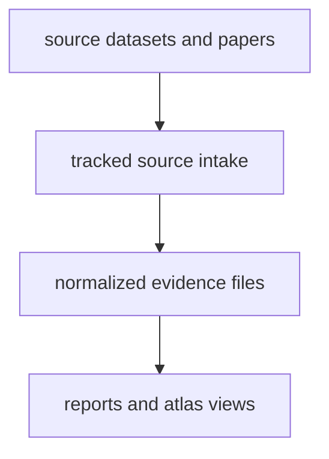

# Data System Overview

The data system in `bijux-pollenomics` is designed to keep different kinds of
evidence visible instead of merging everything into one vague export. Readers
should be able to tell whether they are looking at pollen context,
archaeological context, boundary framing, fieldwork documentation, or ancient
DNA sample evidence.

## The Basic Shape

That structure matters because the repository serves two audiences at once:
people who want to inspect the tracked evidence directly, and people who want
to read the public-facing country or atlas outputs built from it.

## Main Data Families

| Family | Role in the repository | Main location |
| --- | --- | --- |
| Pollen context | environmental and paleoecological context | `data/landclim/`, `data/neotoma/` |
| Archaeology context | broader settlement and environmental archaeology layers | `data/sead/`, `data/raa/` |
| Boundary framing | country filtering and regional map framing | `data/boundaries/` |
| Animal ancient DNA | sample-backed contextual evidence from papers and supplements | `data/adna/` |
| Fieldwork | direct visit and observation records | `docs/04-fieldwork/` |

## Main Repository Surfaces

- `data/` keeps repository-owned source material, normalized records, and review artifacts.
- `docs/report/` keeps the generated country bundles, atlas assets, and public review packets.
- `docs/02-bijux-pollenomics-data/` explains how those tracked files fit together.

## Why The Separation Matters

- A source page should explain what a dataset or paper family contributes.
- An evidence page should explain how sample, locality, date, or coordinate claims are justified.
- An output page should explain what readers can trust in a report or map view.

When those roles blur together, documentation becomes a list of files for
insiders instead of a clear guide for the people actually trying to understand
the repository.
