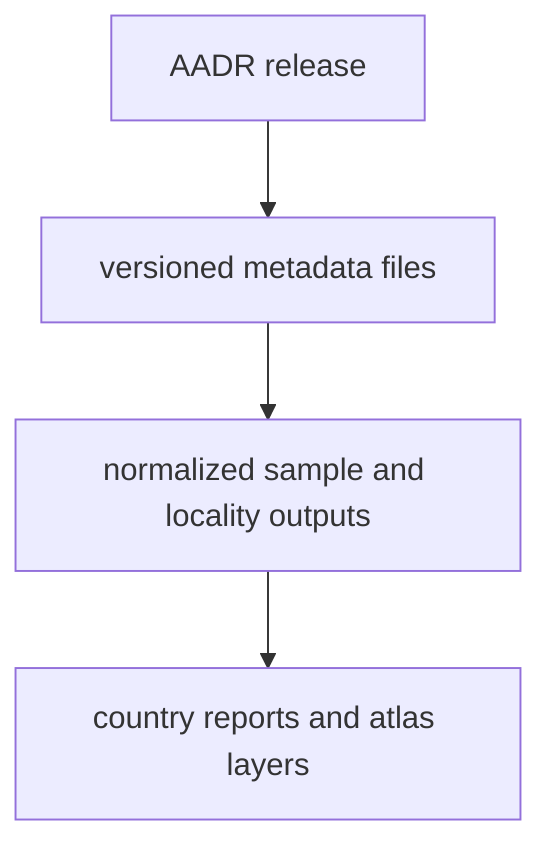

# AADR

AADR is the ancient DNA source family that anchors the repository's current
human ancient DNA context work.

## AADR Source Model

AADR is the clearest example of a release-based source family in this
repository. Readers should be able to see how one versioned metadata release
turns into tracked sample outputs and public reports.

## What This Source Adds

- versioned metadata under `data/aadr/<version>/`
- human sample-locality context used in reports and the shared atlas
- a clear bridge between tracked source refreshes and visible publication
  changes

## Boundary

The repository currently works from public metadata files, not genotype
payloads. AADR supports sample-locality and metadata-based reporting here. It
does not claim to perform population-genetic analysis inside this repository.

## Downstream Outputs

- country-facing bundles under `docs/report/<country-slug>/`
- atlas-facing files under `docs/report/nordic-atlas/`
- versioned source records that stay visible in the tracked tree instead of
  disappearing behind one merged export
