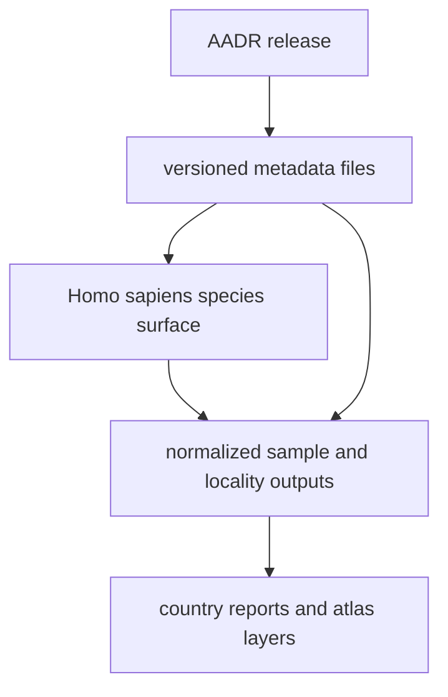

# AADR

AADR is the upstream ancient-DNA source family that currently feeds the
`Homo sapiens` species surface.

## AADR Source Model

This page should make AADR feel like the strongest direct source-to-publication
chain in the repository. Readers should be able to see how one release version
widens into visible report and atlas changes without guessing where the bridge
is.

## What This Source Adds

- versioned metadata under `data/aadr/<version>/`
- species-owned raw intake under `data/adna/homo_sapiens/raw/aadr/<version>/`
- the sample-locality layer that drives country reports and the shared atlas
- the clearest bridge between tracked data refreshes and visible publication
  changes

## Boundary

The repository currently works from public metadata files, not genotype
payloads. This source supports sample-locality and metadata-based reporting. It
does not claim to run population-genetic analysis inside this repository.

## Downstream Outputs

- country-facing bundles under `docs/report/<country-slug>/`
- atlas-facing files under `docs/report/nordic-atlas/`
- versioned source records that stay visible in the tracked tree instead of
  disappearing behind one merged export

## First Proof Check

- inspect `data/adna/homo_sapiens/raw/aadr/`
- inspect `data/aadr/`
- inspect `data/aadr/v66/release_manifest.json`
- open [Normalized AADR Outputs](https://bijux.io/bijux-pollenomics/02-bijux-pollenomics-data/outputs/normalized-aadr/)
  when the question shifts from upstream role to checked-in repository outputs

## Design Pressure

The easy failure is to talk about AADR as if it were the whole ancient-DNA
layer, which hides the `Homo sapiens` species boundary and weakens review of
how one upstream release becomes one governed species-owned runtime surface.
