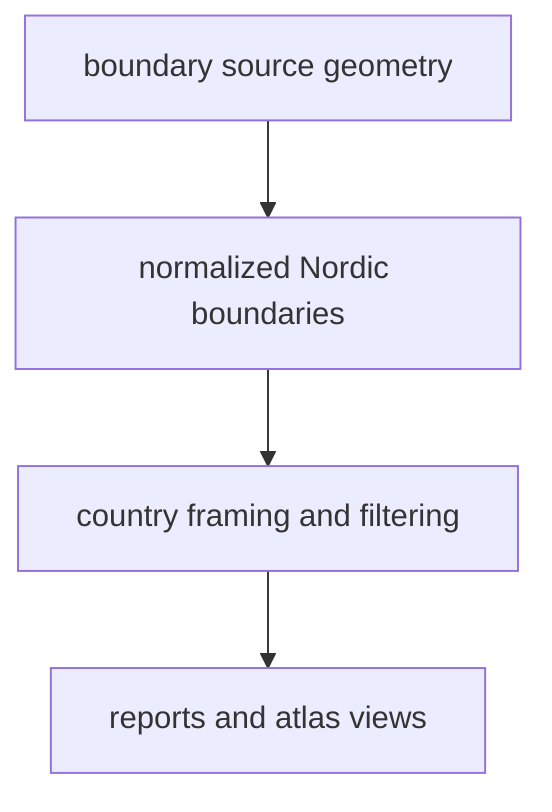

# Boundaries

Boundary data supplies the political framing layer used across the repository.

## Boundary Source Model

Boundary data is not scientific evidence, but it shapes how readers see every
other mapped layer. It defines the country framing used across reports and the
Nordic evidence surface.

## What This Source Adds

- country geometry used for Nordic filtering and map framing
- a shared spatial reference layer used across reports and the atlas
- one stable place to keep country classification separate from scientific
  source logic

## Boundary

Boundary data is a framing surface, not scientific evidence. It can show where
country filters apply, but it does not prove anything about pollen history,
ancient DNA, or archaeology on its own.

## Downstream Outputs

- `data/boundaries/normalized/nordic_country_boundaries.geojson`
- shared geometry in `docs/report/world/`
- country filtering behavior reused by publication bundles
