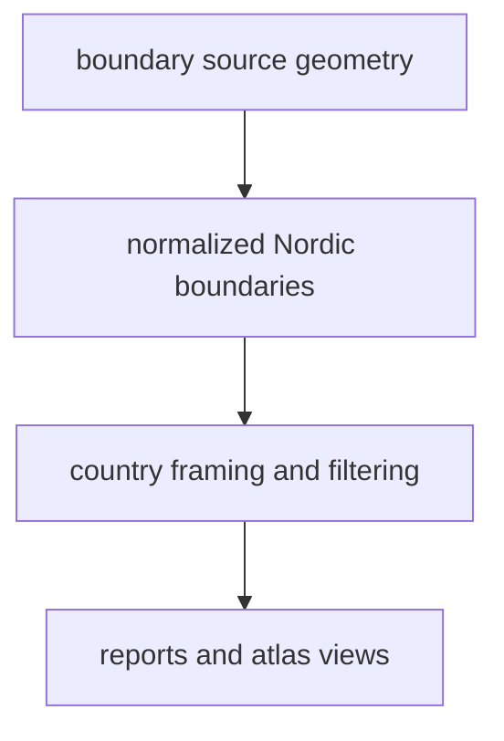

# Boundaries

Boundary data supplies the political framing layer used across the repository.

## Boundary Source Model

This page should make boundaries read as a framing dependency with real
interpretation weight. It is not scientific evidence, but it does shape how
every other mapped layer is seen and filtered.

## What This Source Adds

- country geometry used for Nordic filtering and map framing
- a shared spatial reference layer used across reports and the atlas
- one stable place to keep country classification separate from scientific
  source logic

## Boundary

Boundary data is a framing surface, not scientific evidence. It can show where
country filters apply, but it does not prove anything about pollen history,
ancient DNA, or archaeology on its own.

## Downstream Outputs

- `data/boundaries/normalized/nordic_country_boundaries.geojson`
- shared geometry in `docs/report/nordic-atlas/`
- country filtering behavior reused by publication bundles

## First Proof Check

- inspect `data/boundaries/raw/` and `data/boundaries/normalized/`
- open [Normalized Boundary Outputs](https://bijux.io/bijux-pollenomics/02-bijux-pollenomics-data/outputs/normalized-boundaries/)
  when the question is about the checked-in geometry files

## Design Pressure

The common failure is to treat political geometry as neutral backdrop only,
even though changing the framing surface can silently change how readers parse
every evidence layer on top of it.
