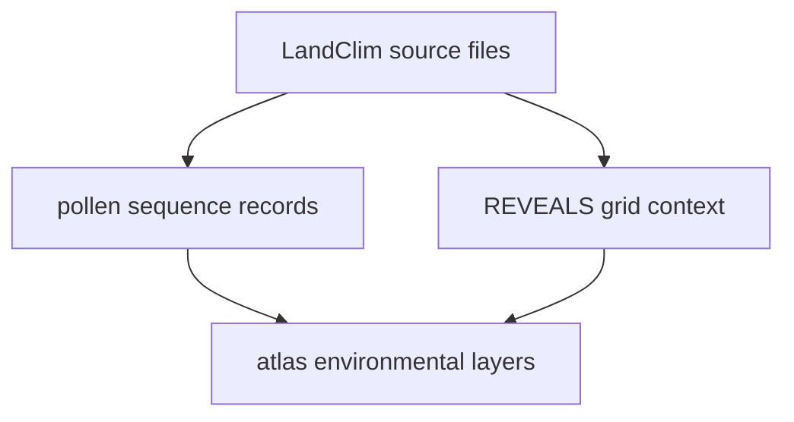

# LandClim

LandClim supplies Nordic pollen sequence context and REVEALS-related spatial
context.

## LandClim Source Model

LandClim is one of the repository's main pollen-context families. It matters
because it carries both site-level sequence context and broader REVEALS grid
context.

## What This Source Adds

- pollen-site sequence records that broaden the atlas beyond ancient DNA
- REVEALS grid-cell context that helps readers see environmental surfaces at a
  larger scale
- one of the main environmental layers that makes the atlas more than a point
  map of sample localities

## Boundary

LandClim is environmental context, not ancient DNA evidence and not direct
fieldwork documentation. Its value is comparative and spatial. It should not
be read as a substitute for sample metadata or on-site visit records.

## Downstream Outputs

- `data/landclim/normalized/nordic_pollen_site_sequences.csv`
- `data/landclim/normalized/nordic_pollen_site_sequences.geojson`
- `data/landclim/normalized/nordic_reveals_grid_cells.geojson`
