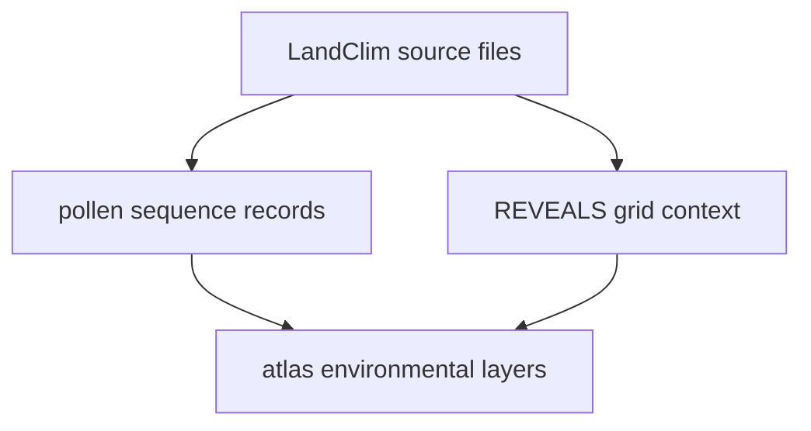

# LandClim

LandClim supplies Nordic pollen sequence context and REVEALS-related spatial
context.

## LandClim Source Model

This page should make LandClim legible as environmental context with two
distinct downstream roles: sequence context and broader grid framing. That is
what keeps it from collapsing into a generic pollen label.

## What This Source Adds

- pollen-site sequence records that broaden the atlas beyond ancient DNA
- REVEALS grid-cell context that helps readers see environmental surfaces at a
  larger scale
- one of the main environmental layers that makes the atlas more than a point
  map of sample localities

## Boundary

LandClim is environmental context, not ancient DNA evidence and not direct
fieldwork documentation. Its value is comparative and spatial. It should not
be read as a substitute for sample metadata or on-site visit records.

## Downstream Outputs

- `data/landclim/normalized/nordic_pollen_site_sequences.csv`
- `data/landclim/normalized/nordic_pollen_site_sequences.geojson`
- `data/landclim/normalized/nordic_reveals_grid_cells.geojson`

## First Proof Check

- inspect `data/landclim/raw/` and `data/landclim/normalized/`
- open [Normalized LandClim Outputs](https://bijux.io/bijux-pollenomics/02-bijux-pollenomics-data/outputs/normalized-landclim/)
  when the question is about the atlas-facing checked-in files

## Design Pressure

The easy failure is to let LandClim inherit the certainty of sample-locality
data because both surfaces end up in the atlas, even though one is contextual
environmental framing.
