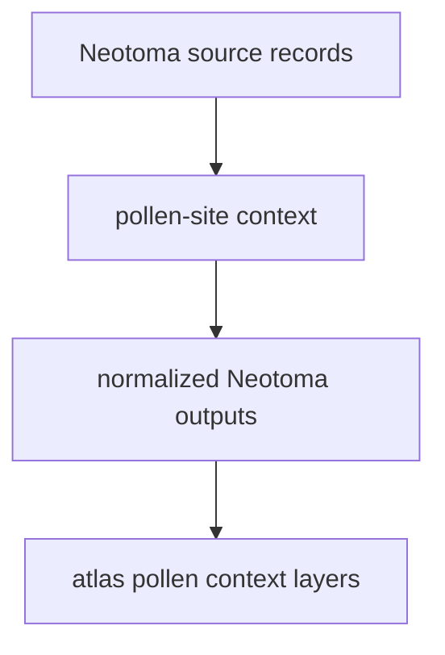

# Neotoma

Neotoma supplies paleoecological pollen-site context to the Nordic workspace.

## Neotoma Source Model

This page should keep Neotoma visible as its own pollen-context family. It
helps readers compare site distributions without pretending that all pollen
context comes from one interchangeable source.

## What This Source Adds

- point-based paleoecological context under `data/neotoma/`
- an independent pollen-family layer that complements LandClim
- source-specific provenance that remains visible even after normalization

## Boundary

Neotoma helps readers compare site distributions and contextual layers. It does
not collapse into one generic pollen source, and it does not answer ancient DNA
questions by itself.

## Downstream Outputs

- `data/neotoma/normalized/nordic_pollen_sites.csv`
- `data/neotoma/normalized/nordic_pollen_sites.geojson`
- shared atlas layers under `docs/report/nordic-atlas/`

## First Proof Check

- inspect `data/neotoma/raw/` and `data/neotoma/normalized/`
- open [Normalized Neotoma Outputs](https://bijux.io/bijux-pollenomics/02-bijux-pollenomics-data/outputs/normalized-neotoma/)
  when the question is about the repository-owned output family

## Design Pressure

The common failure is to merge Neotoma into a generic pollen backdrop, which
erases the source-specific provenance readers need when they judge context
quality and interpretation limits.
