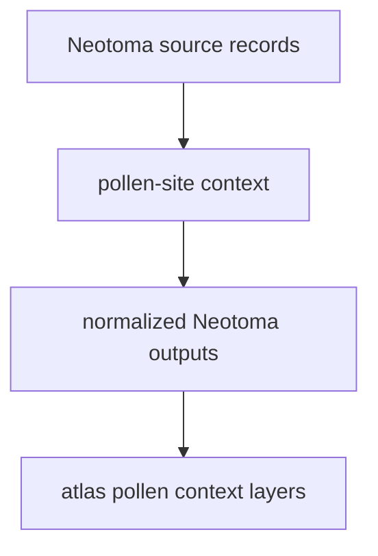

# Neotoma

Neotoma supplies paleoecological pollen-site context to the Nordic workspace.

## Neotoma Source Model

Neotoma is a second major pollen-context family in the repository. Keeping it
visible as its own source helps readers compare pollen coverage without turning
all pollen context into one interchangeable backdrop.

## What This Source Adds

- point-based paleoecological context under `data/neotoma/`
- an independent pollen-family layer that complements LandClim
- source-specific provenance that remains visible even after normalization

## Boundary

Neotoma helps readers compare site distributions and contextual layers. It does
not collapse into one generic pollen source, and it does not answer ancient DNA
questions by itself.

## Downstream Outputs

- `data/neotoma/normalized/nordic_pollen_sites.csv`
- `data/neotoma/normalized/nordic_pollen_sites.geojson`
- shared atlas layers under `docs/report/nordic-atlas/`
