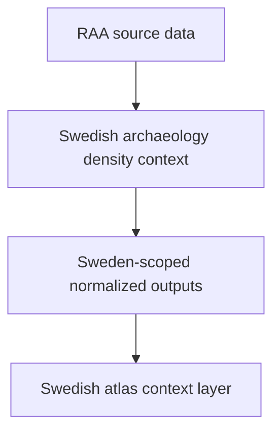

# RAÄ

RAÄ supplies Sweden-specific archaeology context.

## RAÄ Source Model

This page should make the Sweden-only scope impossible to miss. RAÄ is useful
because it is narrower than the atlas, not because it pretends to cover the
whole Nordic region.

## What This Source Adds

- archaeology density context that sharpens Swedish interpretation
- a national surface that helps the atlas show where contextual archaeological
  material clusters
- one clear example of a useful layer that is intentionally not pan-Nordic

## Boundary

RAÄ is valuable precisely because its scope is narrow and explicit. It should
not be presented as a Nordic-wide archaeology source, and it should not be read
as direct evidence outside the Swedish surface it actually covers.

## Downstream Outputs

- `data/raa/normalized/sweden_archaeology_density.geojson`
- `data/raa/normalized/sweden_archaeology_layer.json`
- Swedish atlas context under `docs/report/nordic-atlas/`

## First Proof Check

- inspect `data/raa/raw/` and `data/raa/normalized/`
- open [Normalized RAÄ Outputs](https://bijux.io/bijux-pollenomics/02-bijux-pollenomics-data/outputs/normalized-raa/)
  when the question is about the checked-in Swedish output family

## Design Pressure

The easy failure is to let a visually strong Swedish archaeology layer imply
regional coverage that the source never claimed to provide.
