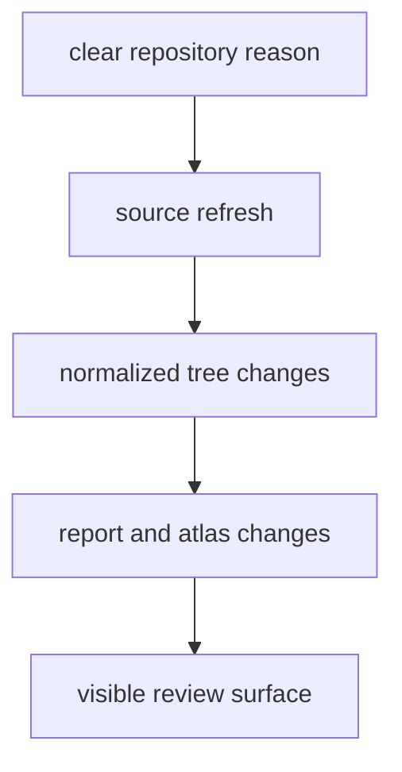

# Refresh Policy

Upstream refreshes are deliberate repository events, not background churn.

## Refresh Model

This page frames refreshes as evidence events with publication impact, not as
invisible maintenance. A source refresh stays safe only while a reader can
follow the change from upstream movement to checked-in outputs.

## Policy

- refresh a source only when there is a clear repository reason
- keep source-specific changes visible in commit history and tracked files
- regenerate dependent outputs when a refresh changes the visible evidence surface
- treat mutable upstream systems as a trust boundary, not as silently stable dependencies

## What This Protects

- reviewers can connect raw-source changes to normalized and published changes
- the atlas and country reports do not drift quietly away from the tracked tree
- source refresh cost stays visible before maintainers widen a change set

## First Proof Check

- inspect `data/collection_summary.json` after a refresh
- inspect the matching `data/*/normalized/` trees and `docs/report/` outputs
- open [tracked outputs and published surfaces](../outputs/index.md) when the question becomes which public evidence moved

## Design Pressure

The common failure is to treat refreshes as background upkeep, which hides the
fact that mutable upstream systems can widen directly into visible atlas and
report changes inside one repository revision.
