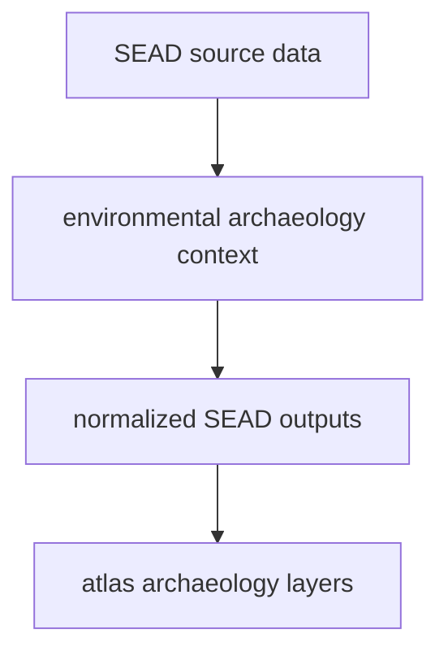

# SEAD

SEAD supplies environmental archaeology context to the tracked data tree.

## SEAD Source Model

This page should show why SEAD belongs beside RAÄ without becoming identical to
it. SEAD gives broader archaeology context, but it still keeps its own source
story and evidence limits.

## What This Source Adds

- archaeological site context that complements pollen and ancient DNA layers
- point-based evidence that helps the atlas show wider environmental
  archaeology distribution
- a second archaeology family whose scope and interpretation differ from RAÄ

## Boundary

SEAD is contextual archaeology evidence, not a replacement for pollen layers,
not a direct field log, and not equivalent to the Sweden-only RAÄ surface. Its
meaning depends on being read beside the other normalized layers.

## Downstream Outputs

- `data/sead/normalized/nordic_environmental_sites.csv`
- `data/sead/normalized/nordic_environmental_sites.geojson`
- atlas context layers under `docs/report/nordic-atlas/`

## First Proof Check

- inspect `data/sead/raw/` and `data/sead/normalized/`
- open [Normalized SEAD Outputs](https://bijux.io/bijux-pollenomics/02-bijux-pollenomics-data/outputs/normalized-sead/)
  when the question is about the checked-in repository output family

## Design Pressure

The common failure is to flatten archaeology context into one layer family,
which makes broader SEAD context and Sweden-scoped RAÄ context look more
equivalent than they actually are.
