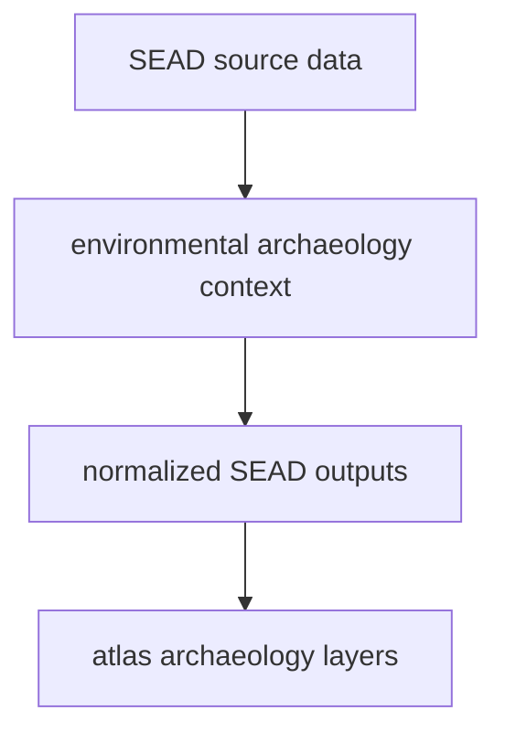

# SEAD

SEAD supplies environmental archaeology context to the tracked data tree.

## SEAD Source Model

SEAD belongs beside RAÄ, but it is not the same kind of archaeology source.
It provides broader environmental archaeology context with its own coverage and
limits.

## What This Source Adds

- archaeological site context that complements pollen and ancient DNA layers
- point-based evidence that helps the atlas show wider environmental
  archaeology distribution
- a second archaeology family whose scope and interpretation differ from RAÄ

## Boundary

SEAD is contextual archaeology evidence, not a replacement for pollen layers,
not a direct field log, and not equivalent to the Sweden-only RAÄ surface. Its
meaning depends on being read beside the other normalized layers.

## Downstream Outputs

- `data/sead/normalized/nordic_environmental_sites.csv`
- `data/sead/normalized/nordic_environmental_sites.geojson`
- atlas context layers under `docs/report/nordic-atlas/`
