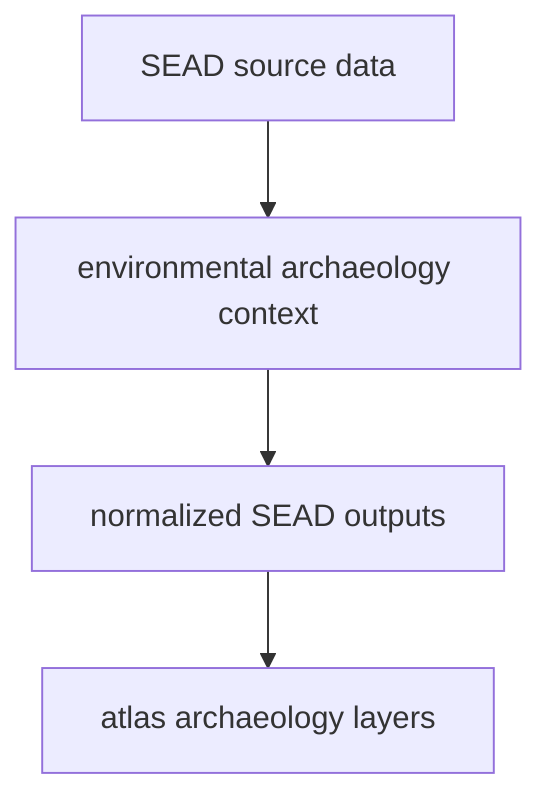

# SEAD

SEAD supplies environmental archaeology context to the tracked data tree.

## SEAD Source Model

SEAD belongs beside RAÄ, but it is not the same kind of archaeology source.
It provides broader environmental archaeology context with its own coverage and
limits.

The important correction is temporal honesty. SEAD rows are site-level
archaeology context. Some rows carry numeric spans, some carry relative period
labels, and some carry both. The repository now keeps those distinctions in
`data/sead/review/temporal_review.json` instead of flattening everything into
one clean-looking BP interval.

## What This Source Adds

- archaeological site context that complements pollen and ancient DNA layers
- point-based evidence that helps the atlas show wider environmental
  archaeology distribution
- a second archaeology family whose scope and interpretation differ from RAÄ
- governed period labels, duration ranges, and temporal uncertainty that remain
  visible through normalization

## Boundary

SEAD is contextual archaeology evidence, not a replacement for pollen layers,
not a direct field log, and not equivalent to the Sweden-only RAÄ surface. Its
meaning depends on being read beside the other normalized layers.

When SEAD publishes a numeric span, that span still belongs to a site-level
context surface. It is not automatically comparable to one sample-owned animal
date. See [Temporal Semantics](../evidence/temporal-semantics.md) for the
shared comparison rules.

## Downstream Outputs

- `data/sead/normalized/nordic_environmental_sites.csv`
- `data/sead/normalized/nordic_environmental_sites.geojson`
- `data/sead/review/temporal_review.json`
- atlas context layers under `docs/report/world/`
