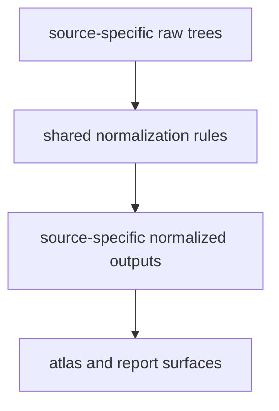

# Shared Normalization

The repository normalizes different source families into reviewable,
publication-ready shapes without pretending that the sources are the same.

## Normalization Model

Normalization should look like narrowing, not flattening. The repository
aligns file shapes and review cost while keeping source identity and caveats
visible all the way into publication.

## Shared Expectations

- each source keeps its own raw and normalized identity
- normalized files are shaped for atlas and report consumption
- country filtering and spatial interpretation stay consistent across layers
- provenance stays inspectable after normalization rather than being hidden behind one merged export

## Boundary

Shared normalization narrows format and review cost. It does not erase
source-specific caveats, and it does not make a contextual layer
interchangeable with ancient DNA metadata or direct fieldwork.

## First Proof Check

- compare one raw tree and one normalized tree under `data/*/`
- inspect the shared atlas bundle under `docs/report/nordic-atlas/`
- compare with [output surface classes](../outputs/output-surface-classes.md) when the question is which normalized files are context, evidence, or scaffolding

## Design Pressure

The easy failure is to celebrate shared output shapes so much that readers stop
seeing which caveats survived normalization and which evidence families remain
fundamentally different.
