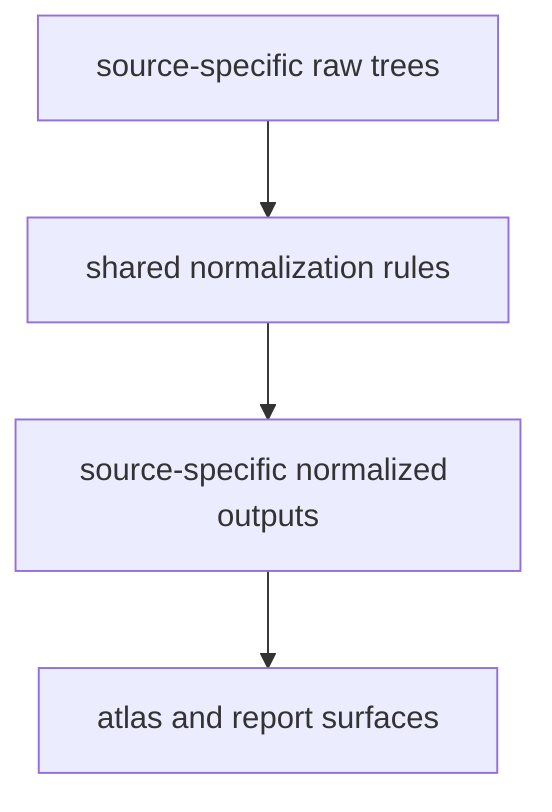

# Shared Normalization

The repository normalizes different source families into reviewable,
publication-ready shapes without pretending that the sources are the same.

## Normalization Model

Normalization should look like narrowing, not flattening. In this repository a
normalized output is a repository-owned evidence surface with a durable file
contract, a stable owning path, and enough preserved provenance that a reviewer
can still trace the claim back to its capture layer.

## Shared Expectations

- each source keeps its own raw and normalized identity
- normalized files are shaped for atlas and report consumption without becoming one merged export
- country filtering and spatial interpretation stay consistent across layers
- provenance stays inspectable after normalization rather than being hidden behind one merged export
- governing surfaces stay visible in `data/source_fact_ownership_registry.json`

## Boundary

Shared normalization narrows format and review cost. It does not erase
source-specific caveats, and it does not make a contextual layer
interchangeable with ancient DNA metadata or direct fieldwork.

## First Proof Check

- compare one raw tree and one normalized tree under `data/*/`
- inspect `data/evidence_artifact_contracts.json` when the question is which file shape governs one artifact scope
- inspect the world surface bundle under `docs/report/world/`
- compare with [output surface classes](../outputs/output-surface-classes.md) when the question is which normalized files are context, evidence, or scaffolding

## Design Pressure

The easy failure is to celebrate shared output shapes so much that readers stop
seeing which caveats survived normalization and which evidence families remain
fundamentally different.
